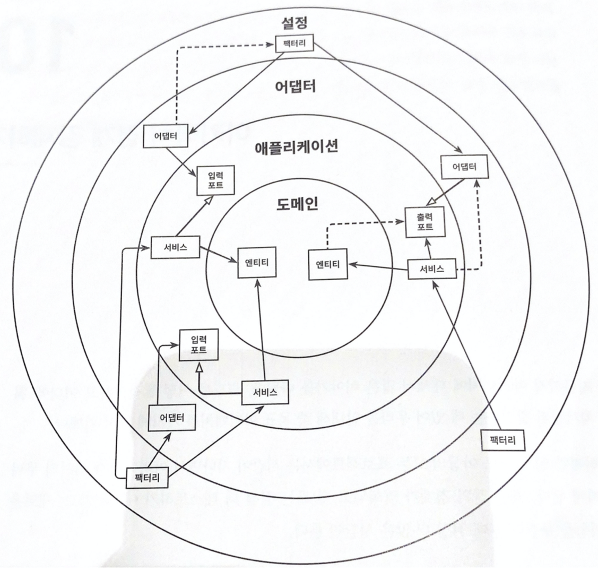
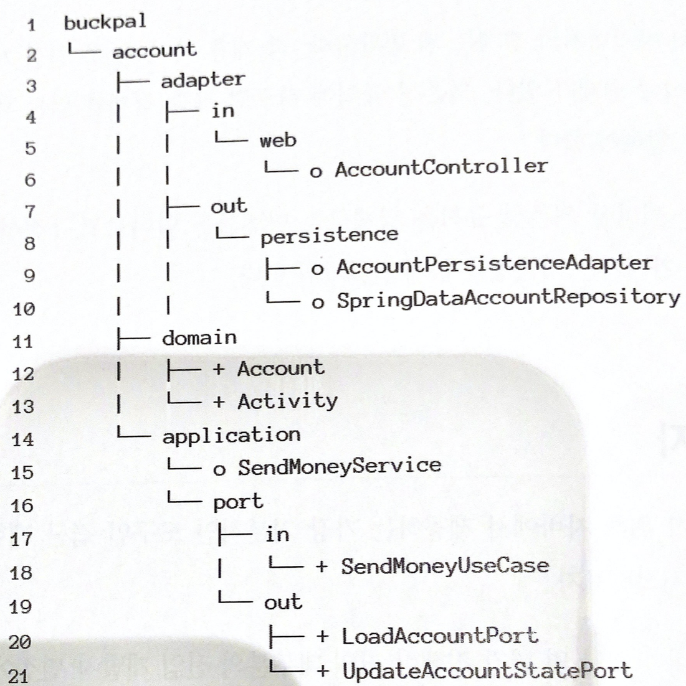
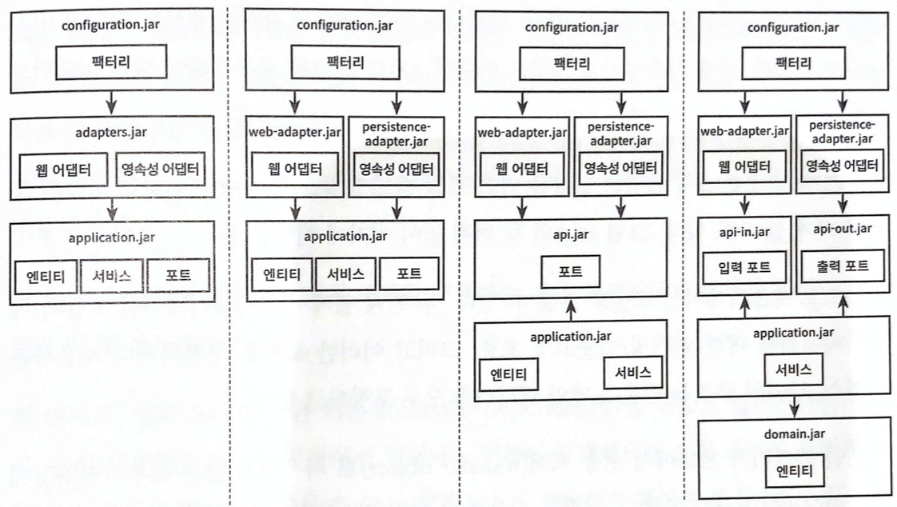

# 10장. 아키텍처 경계 강제하기

## 경계와 의존성

- 아키텍처의 어디에 경계가 있고, ‘경계를 강제한다’는 것이 어떤 의미인지 먼저 알아보자.
    
    
    
    아키텍처 경계를 강제한다는 것은 의존성이 올바른 방향을 향하도록 강제하는 것을 의미한다. 아키텍처에서 허용되지 않은 의존성을 점선 화살표로 표시했다.
    
- 가장 안쪽의 계층에는 도메인 엔티티가 있다. 애플리케이션 계층은 애플리케이션 서비스 안에 유스케이스를 구현하기 위해 도메인 엔티티에 접근한다. 어댑터는 인커밍 포트를 통해 서비스에 접근하고, 반대로 서비스는 아웃고잉 포트를 통해 어댑터에 접근한다.
- 의존성 규칙에 따르면 계층 경계를 넘는 의존성은 항상 안쪽 방향으로 향해야 한다.

## 접근 제한자

- 경계를 강제하기 위해 자바에서 제공하는 가장 기본적인 도구인 접근 제한자부터 시작해보자.
- public, protected, private, package-private 제한자가 있다.
- package-private가 중요한 이유는 패키지를 통해 클래스들을 응집적인 ‘모듈’로 만들어 주기 때문이다. 모듈내에서는 접근 가능하지만 패키지 바깥에서는 접근할 수 없다.
    
    
    
    접근 제한자가 추가된 패키지 구조
    
- persistnece 패키지에 있는 클래스들은 외부에서 접근할 필요가 없기 때문에 package-private(이미지에서 ‘o’로 표시)으로 만들 수 있다. 영속성 어댑터는 자신이 구현하는 출력포트를 통해 접근된다. 같은 이유로 SendMoneyService를 package-private으로 만들 수 있다.
- domain 패키지는 다른 계층에서 접근할 수 있어야 하고, application 계층은 web 어댑터와 persistence 어댑터에서 접근 가능해야 한다.
- package-private 제한자는 몇 개 정도의 클래스로만 이뤄진 작은 모듈에서 가장 효과적이다.

## 컴파일 후 체크

- 클래스에 public 제한자를 쓰면 아키텍처 상의 의존성 방향이 잘못되더라도 컴파일러는 다른 클래스들이 이 클래스를 사용하도록 허용한다.
- 이를 막기 위한 한 가지 방법은 컴파일 후 체크(post-compile check)를 도입하는 것이다. 코드가 컴파일 된 후 런타임에 체크를 한다는 것이다.

## 빌드 아티팩트

- 지금까지 코드 상에서 아키텍처 경계를 구분하는 유일한 도구는 패키지였다. 모든 코드가 같은 모놀리식 빌드 아티팩트의 일부였던 셈이다.
- 빌드 아티팩트는 빌드 프로세스의 결과물이다. 빌드도구를 사용하여  컴파일하고 테스트하고 패키징 할 수 있었다.
- 빌드 도구의 주요한 기능 중 하나는 의존성 해결이다. 코드를 빌드 아티팩트로 변환하기 위해 빌드 도구가 가장 먼저 할 일은 코드베이스가 의존하고 있는 모든 아티팩트가 사용 가능한지 확인하는 것이다. 만약 사용 불가능한 것이 있다면 아티팩트 리포지토리로부터 가져오려고 시도한다. 이마저도 실패하면 컴파일도 하기 전에 에러와 함께 빌드가 실패한다.
- 이를 활용해서 모듈과 아키텍처의 계층 간의 의존성을 강제할 수 있다. 각 모듈 혹은 계층에 대해 전용 코드 베이스와 빌드 아티팩트로 분리된 빌드 모듈(JAR 파일)을 만들 수 있다.
    
    
    
    잘못된 의존성을 막기 위해 아키텍처를 여러 개의 빌드 아티팩트로 만드는 여러 가지 방법
    
- 맨 왼쪽에는 설정, 어댑터, 애플리케이션 계층의 빌드 아티팩트로 이뤄진 기본적인 3개의 모듈 빌드 방식이 있다. 설정 모듈은 어댑터 모듈에 접근 할 수 있고, 어댑터 모듈은 애플리케이션 모듈에 접근할 수 있다.
- 어댑터 모듈은 영속성 어댑터 뿐만 아니라 웹 어댑터도 포함하고 있다. 즉, 빌드 도구가 두 어댑터 간의 의존성을 막지 않을 것이라는 뜻이다.
- 각각의 기능을 모듈로 쪼개서 접근을 제한하도록 한다.
- 밀드 모듈로 아키텍처 경계를 구분하는 것은 패키지로 구분하는 방식과 비교했을 때 몇가지 장점이 있다.
    - 첫번째, 빌드도구가 순환 의존성을 극도로 싫어한다. 순환 의존성은 하나의 모듈에서 일어나는 변경이 잠재적으로 순환 고리에 포함된 다른 모든 모듈을 변경하게 만들며 다인 책임 원칙을 위배하기 때문에 좋지 않다. 빌드도구는 이러한 순환 의존성을 허용하지 않는다. 반면 자바 컴파일러는 순환 의존성이 있든 말든 신경 쓰지 않는다.
    - 두번째, 빌드 모듈 방식에서는 특정 모듈의 코드를 격리한채로 변경할 수 있다.
    - 마지막으로 모듈 간 의존성이 빌드 스크립트에 분명하게 선언돼 있기 때문에 새로 의존성을 추가하는 일은 우연이 아닌 의식적인 행동이 된다.

## 유지보수 가능한 소프트웨어를 만드는 데 어떻게 도움이 될까?

- 소프트웨어 아키텍처는 아키텍처 요소 간의 의존성을 관리하는 게 전부다. 만약 의존성이 거대한 진흙 덩어리가 된다면 아키텍처 역시 거대한 진흙 덩어리가 된다.
- 그렇기 때문에 지속적으로 의존성이 올바를 방향을 가르키고 있는지 확인해야 한다.
- 새로운 코드를 추가 하거나 리팩터리 할 때 패키지 구조를 항상 염두에 둬야 하고, 가능하다면 package-private 가시성을 이용해 패키지 바깥에서 접근하면 안 되는 클래스에 대한 의존성을 피해야 한다.
- 그리고 아키텍처가 충분히 안정적이면 아키텍처 요소를 독립적인 빌드 모듈로 추출해야 한다.