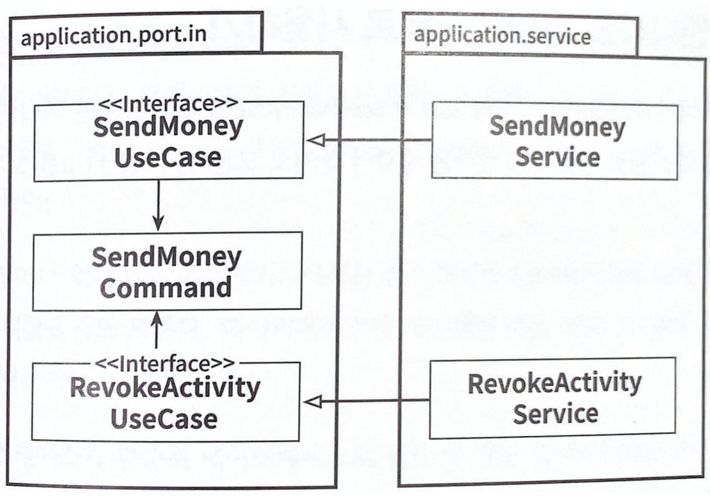
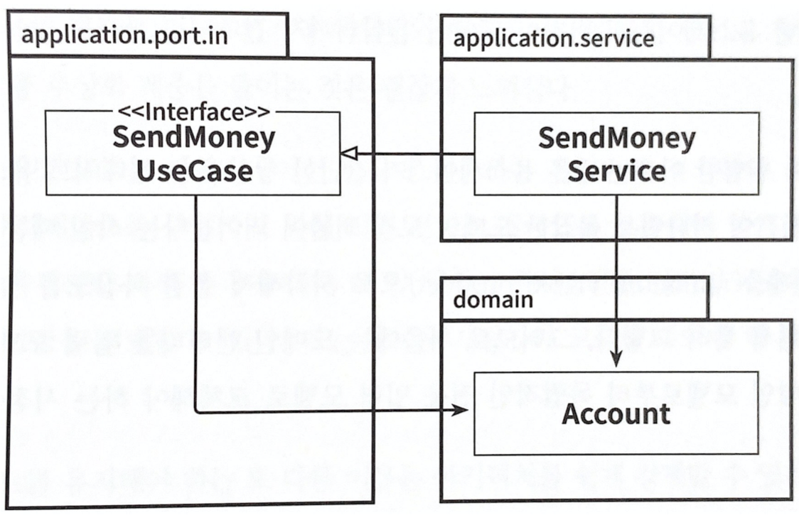
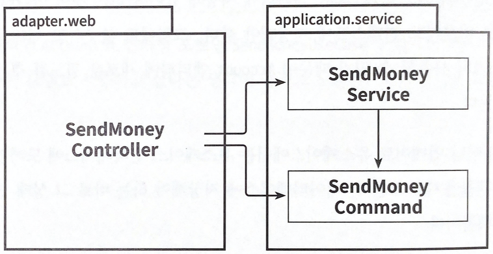
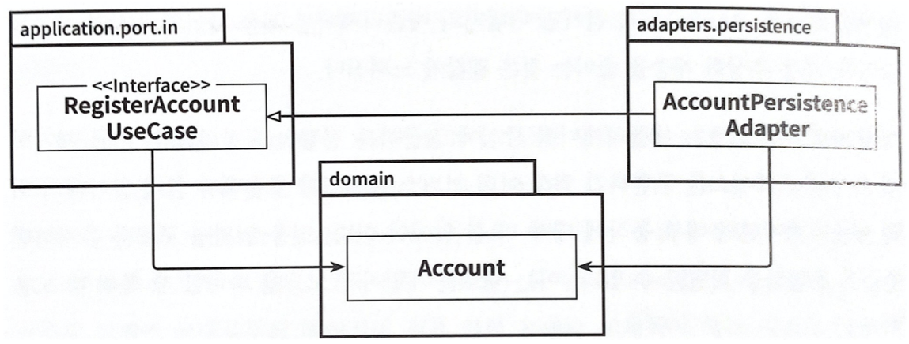

# 11장. 의식적으로 지름길 사용하기

- 기술 부채를 쌓아가는 지름길의 유혹을 방지 하기위해서는 지름길 자체를 파악해야 한다.

## 왜 지름길은 깨진 창문 같을까?

    > 💡 어떤 것이 멈춘 것처럼 보이고, 망가져 보이고, 관리 되지 않는다고 여겨지면 인간의 뇌는 이를 더 멈추고 망가뜨려도 된다고 생각하게 된다.

- 이를 코드 작업에 대입해보자.
    - 품질에 떨어진 코드에서 작업할 때 더 낮은 품질의 코드를 추가하기 쉽다.
    - 코딩 규칙을 많이 어긴 코드에서 또 다른 규칙을 어기기도 쉽다.
    - 지름길을 많이 사용한 코드에서 작업할 때 또 다른 지름길을 추가하기도 쉽다.

## 깨끗한 상태로 시작할 책임

- 가능한 지름길을 쓰지 않고 기술부채를 지지 않은 채로 프로젝트를 깨끗하게 시작하는 것이 중요하다.
- 스프트웨어 프로젝트는 큰 비용과 장기적인 노력이 필요하기 때문에 깨진 창문을 맞는 것이 개발자의 큰 책임이다.
- 하지만 지름길이 필요할 때가 있다. 중요하지 않거나, 프로토 타이핑 작업중이거나, 경제적인 이유가 있을 수 있다. 이런 의도적인 지름길에 대해서는 기록을 잘 해야한다. 미래에 프로젝트를 인계 받는 이들에게 빚을 지고 있는 것이다.

## 유스케이스 간 모델 공유하기

- 4장에서 유스케이스마다 다른 입출력 모델을 가져야 한다고 했다. 즉 입력 파라미터 타입과 반환값의 타입이 달라야 한다는 뜻이다.
    
    
    
    유스케이스 간에 입출력 모델을 공유하게 되면 유스케이스들 사이에 결합이 생긴다.
    
- 공유로 인한 영향은 SendMoneyUseCase와 RevokeActivityUseCase가 결합된다는 것이다. 공유하고 있는 SendMoneyCommand 클래스가 변경되면 두 유스케이스 모두 영향을 받는다. 단일 책임 원칙에서 이야기하는 ‘변경할 이유’를 공유하는 것이다.
- 유스케이스간 입출력 모델을 공유하는 것은 유스케이스들이 기능적으로 묶여 있을 때 유효하다. 특정 세부사항을 변경 할 경우 두 유스케이스 모두에 영향을 주고 싶은 경우가 해당한다.
- 두 유스케이스가 독립적으로 진화해야 한다면 입출력 모델을 공유하는 방식은 지름길이 된다. 독립적으로 진화해야 한다면 분리한 후 시작해야 한다.
- 비슷한 개념의 유스케이스를 여러개 만들더라도 독립적으로 진화할 필요가 있다면 입출력 모델을 분리해야 한다.

## 도메인 엔티티를 입출력 모델로 사용하기

- 도메인 엔티티인 Account와 인커밍 포트인 SendMoneyUseCase가 있으면 엔티티를 인커밍 포트의 입출력 모델로 사용한다고 가정해보자.
    
    
    
    도메인 엔티티를 유스케이스의 입출력 모델로 사용하면 도메인 엔티티가 유스케이스에 결합된다.
    
- 인커밍 포트는 도메인 엔티티에 의존성을 가지고 있다. 그 결과, Account 엔티티는 변경할 또 다른 이유가 생겼다.
- Account 엔티티는 SendMoneyUseCase에 의존성이 없으니 인커밍 포트가 어떻게 엔티티를 변경할 이유가 된다는 뜻일까?
- 만약 Account에는 없는 정보를 유스케이스가 필요로 한다고 생각해보자. 해당 정보는 Account가 아니라 다른 도메인이나 바운디드 컨텍스트에 저장돼야 한다. 하지만 이미 사용하고 있는 Account 엔티티에 새로운 필드를 추가 하면 되지 않을까 라는 생각이 든다.
- 간단한 생성이나 업데이트 유스케이스에서는 유스케이스 인터페이스에 도메인 엔티티가 있는 것이 괜찮을지도 모른다.
- 하지만 복잡한 도메인 로직을 구현해야 한다면 해당 유스케이스 인터페이스에 대한 전용 입출력 모델을 만들어야 한다.
- 이 지름길이 위험한 이유는 많은 유스케이스가 간단한 생성 또는 업데이트 유스케이스로 시작해서 시간이 지나면 복잡한 도메인 로직 괴물이 되어 간다는 사실 때문이다. 처음에는 도메인 엔티티를 입력 모델로 사용했더라도 도메인 모델로부터 독립적인 전용 입력 모델로 교체해야 하는 시점을 잘 파악해야 한다.

## 인커밍 포트 건너뛰기

- 아웃고잉 포트는 애플리케이션 계층과 아웃고잉 어댑터 사이의 의존성을 역전 시키키 위한 필수요소인 반면 인커밍 포트는 의존성 역전에 필수적인 요소는 아니다.
    
    
    
    인커밍 포트가 없으면 도메인 로직의 진입점이 불분명해진다.
    
- 인커밍 포트를 제거함으로써 인커밍 어댑터와 애플리케이션 계층 사이의 추상화 계층을 줄였다. 그럭저럭 괜찮아 보인다.
- 하지만 인커밍 포트는 애플리케이션 중심에 접근하는 진입점을 정의한다. 이를 제거하면 특정 유스케이스를 구현하기 위해 어떤 서비스 메서드를 호출해야 할지 알아내기 위해 애플리케이션 내부 동작에 대해 더 잘 알아야 한다. 인커밍 포트를 통해 한눈에 진입점을 파악할 수 있다.
- 인커밍 포트를 유지애햐 하는 또 다른 이유는 아키텍처를 쉽게 강제할 수 있기 때문이다. 아키텍처를 강제하면 어댑터가 애플리케이션 서비스가 아닌 인커밍 포트만 호출 할 수 있다.
- 규모가 작거나 인커밍 어댑터가 하나밖에 없어서 단숨에 흐름을 파악할 수 있다면 없는것이 편하지만 그 이후로도 계속 유지가 될 수 있을거라 확신할 수 있을까?

## 애플리케이션 서비스 건너뛰기

- 어떤 유스케이스는 애플리케이션 계층을 통째로 건너뛰고 싶을 수도 있다.
    
    
    
    애플리케이션 서비스가 없으면 도메인 로직을 둘 곳이 없다.
    
- 아웃고잉 어댑터에 있는 AccountPersistenceAdapter 클래스는 직접 인커밍 포트를 구현해서 일반적으로 인커밍 포트를 구현하는 애플리케이션 서비스를 대체한다.
- 간단한 CRUD 유스케이스에서는 보통 애플리케이션 서비스가 도메인 로직 없이 생성, 업데이트, 삭제요청을 그대로 영속성 어댑터에 전달하기 때문에 유혹에 넘어 갈 수 있다.
- 하지만 이 방법은 인커밍 어댑터와 아웃고잉 어댑터 사이에 모델을 공유해야 한다. 이 경우 공유 모델은 Account 도메인 엔티티 이므로 도메인 모델을 입력 모델로 사용하는 케이스가 되는 것이다.
- 유스케이스가 엔티티를 단순 생성, 수정, 삭제 하는 것보다 더 많은 일을 하게 되면 애플리케이션 서비스를 만든다는 명확한 가이드라인을 팀에 정해둬야 한다.

## 유지보수 가능한 소프트웨어를 만드는 데 어떻게 도움이 될까?

- 간단한 CURD 유스케이스에 대해서는 전체 아키텍처를 구현하는 것이 지나치게 느껴지기 때문에 지름길의 유혹을 느낄 수 있다. 하지만 모든 애플리케이션은 처음에는 작게 시작하기 때문에 언제 단순 CRUD 상태를 벗어나는지 합의 하는 것이 중요하다.