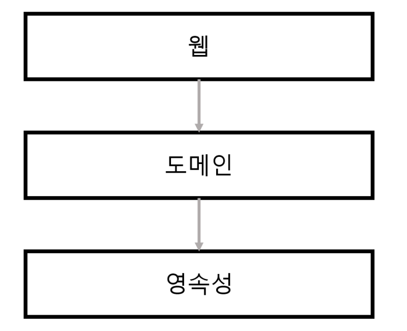
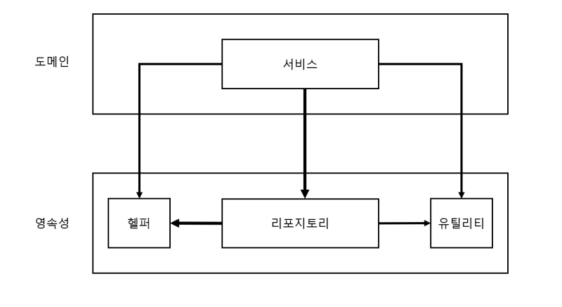
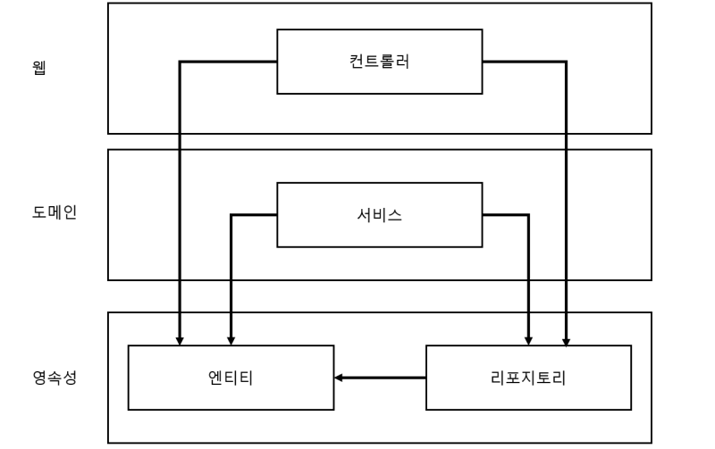
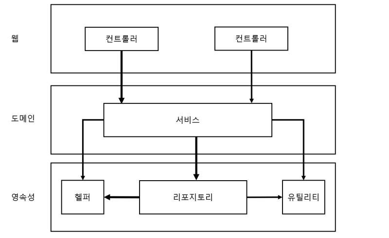

# 1장. 계층형 아키텍처의 문제는 무엇일까?

다음의 그림은 전통적인 웹 애플리케이션의 구조이다.

일반적인 3계층 아키텍처

- 맨 위의 웹계층에서 요청을 받아 도메인 혹은 비즈니스 계층에 있는 서비스로 요청을 보낸다.
- 서비스에서는 비즈니스 로직을 수행하고 도메인 엔티티의 현재 상태를 조회, 변경을 위해 영속성 계층의 컴포넌트를 호출한다.
- 계층형 아키텍처는 견고한 아키텍처 패턴이다. 그렇다면 계층형 아키텍처의 문제점은 무엇일까?

## 계층형 아키텍처는 데이터베이스 주도 설계를 유도한다.

- 전통적인 계층형 아키텍처의 토대는 데이터베이스다.
- 웹 계층은 도메인 계층에 의존하고, 도메인 계층은 영속성 계층에 의존하기 때문에 자연스레 데이터베이스에 의존하게 된다.
- 이렇게 데이터베이스를 토대로 아키텍처가 만들어진 이유는 애플리케이션을 만들때 데이터베이스의 구조를 먼저 생각하고, 도메인 로직을 구현하기 때문이다.
- 이는 의존성의 방향에 따라 자연스럽게 구현한 것이지만 비즈니스 관점에서는 맞지 않는 방법이다. 다른 무엇보다 도메인 로직을 먼저 만들어야 한다. 로직을 정확히 이해하고 그 로직이 맞다는 것을 확인 후 영속성 계층과 웹 계층을 만들어야 한다.
- 데이터베이스 중심적 아키텍처가 만들어지는 가장 큰 원인은 ORM(객체관계매핑) 프레임워크를 사용하기 때문이다.
    
    
    
    도메인 계층에서 데이터 베이스 엔티티를 사용하는 것은 영속성 계층과의 강한 결합을 유발한다.
    
- ORM에 의해 관리되는 엔티티들은 일반적으로 영속성 계층에 둔다.
- 계층은 아래 방향으로만 접근 가능하므로 도메인 계층에서는 이러한 엔티티에 접근하고 사용하게 된다.
- 이렇게 되면 영속성 계층과 도메인 계층 사이에 강한 결합이 발생한다.
- 서비스는 영속성 모델을 비즈니스 모델처럼 사용하게 되고 이로 인해 도메인 로직뿐만 아니라 즉시로딩, 지연로딩, 데이터베이스 트랜잭션, 캐시플러시 등 영속성 계층과 관련된 작업을 해야한다.
- 이는 영속성 코드가 도메인 코드에 녹아들어가서 둘 중 하나만 바꾸는 것이 어려워 진다.

## 지름길을 택하기 쉬워진다.

- 전통적인 계층형 아키텍처에서 특정한 계층에서는 같은 계층이나 아래 계층에만 접근이 가능하다는 것이 규칙이다.
- 만약 상위 계층에 위치한 컴포넌트에 접근해야 한다면? 간단하게 해당 컴포넌트를 계층 아래로 내려 버리면 된다.
    
    
    
    영속성 계층에서는 모든 것에 접근 가능하기 떄문에 시간이 지나면서 점점 비대해진다.
    
- 오랜 기간 개발이 진행되면 위와 같이 될 확률이 높다.
- 어떤 계층에도 속하지 않는 것처럼 보이는 헬퍼, 유틸리티 컴포넌트를 아래 계층에만 접근해야 한다는 규칙때문에 영속성 계층으로 내려 버린것이다.
- 영속성 계층(최하단 계층)은 점점 비대해 진다.

## 테스트하기 어려워진다.

- 계층형 아키텍처를 사용할 때 계층을 건너뛰어 사용하기도 한다.
    
    
    
    도메인 계층을 건너뛰는 것은 도메인 로직을 코드 여기저기에 흩어지게 만든다.
    
- 엔티티 필드를 단 하나만 조작하면 되는 경우에 웹 계층에서 바로 영속성 계층에 접근하면 되지 않을까? 라는 생각으로 작업을 할 수 있다.
- 하지만 이런 방식은 두 가지 문제점이 생긴다.
- 첫 번째, 단 하나의 필드를 조작하는 것이라도 도메인 로직을 웹 계층에 구현하게 된다는 것이다.
- 만약 앞으로 유스케이스가 확장되면 더 많은 도메인 로직을 웹 계층에 추가해서 핵심 도메인 로직들이 퍼져나갈 확률이 높다.
- 두 번째, 웹 계층 테스트에서 도메인 계층뿐만 아니라 영속성 계층도 모킹(mocking)해야 한다는 것이다.
- 이는 단위 테스트의 복잡도가 높아진다. 이는 결국 테스트를 전혀 작성하지 않는 방향으로 가게 된다.

## 유스케이스를 숨긴다.

- 개발자들은 보통 새로운 유스케이스를 구현하기 보다 기존 코드를 바꾸는 데 더 많은 시간을 사용한다.
- 기능을 추가하거나 변경할 적절한 위치를 찾아야 하므로 아키텍처는 코드를 빠르게 탐색할 수 있게 도움이 되어야 한다.
- 하지만 계층형 아키텍처의 경우 도메인 로직이 여러 계층에 걸쳐 흩어지기 쉽다. 유스케이스가 간단해서 웹 계층에 존재할 수도 있고, 영속성 계층에 존재할 수 있다.
- 이럴 경우 적당한 위치를 찾는 것은 매우 어렵다.
- 또한 계층형 아키텍처에서는 도메인 서비스의 너비에 관한 규칙을 강제하지 않기 때문에 여러 유스케이스를 담당하는 아주 넓은 서비스가 만들어 지기도 한다.
    
    
    
- 넓은 서비스는 영속성 계층에 많은 의존성을 가지고, 이러한 서비스를 많은 웹 계층의 컴포넌트들이 의존하게 된다. 이는 테스트와 유스케이스를 책임 지는 서비스도 찾기 어려워 진다.
- 좁은 서비스가 유스케이스 하나만 담당하게 하면 이러한 작업들은 수월해질 것이다

## 동시 작업이 어려워진다.

    > 💡 “지연되는 소프트웨어 프로젝트에 인력을 더하는 것은 개발을 늦출 뿐이다.”

- 계층형 아키텍처는 동시작업의 측면에서는 도움이 되지 않는다.
- 모든 것이 영속성 계층 위에 만들어 지므로 영속성 계층을 먼저 개발해야 하고, 다음 도메인 계층, 그리고 마지막으로 웹 계층을 만들어야 한다. 그렇기 때문에 특정 기능은 한 명의 개발자만 작업 할 수 있다.
- 인터페이스를 먼저 정의 하고, 인터페이스로 각 개발자들이 작업을 하면 된다고 이야기 할 수 있다. 하지만 이는 영속성 로직이 도메인 로직과 뒤섞여 개별적인 작업을 할 수 없게 하는 데이터베이스 주도 설계가 아닐 경우에만 가능하다.
- 넓은 서비스가 있을 경우에는 더욱 어렵다. 다른 유스케이스에 대한 작업을 하지만 같은 서비스를 편집해야 하기 때문에 병합충돌이 발생할 수 있다.

## 유지보수 가능한 소프트웨어를 만드는 데 어떻게 도움이 될까?

- 위에서 살펴본 계층형 아키텍처의 함정을 염두에 두고, 여러 규칙을 추가하여 엄격하게 적용 한다면 계층형 아키텍처 뿐만 아니라 다른 아키텍처 스타일로 만들어도 유지보수하기에 쉬운 솔루션을 만드는 데 도움이 될 것이다.
