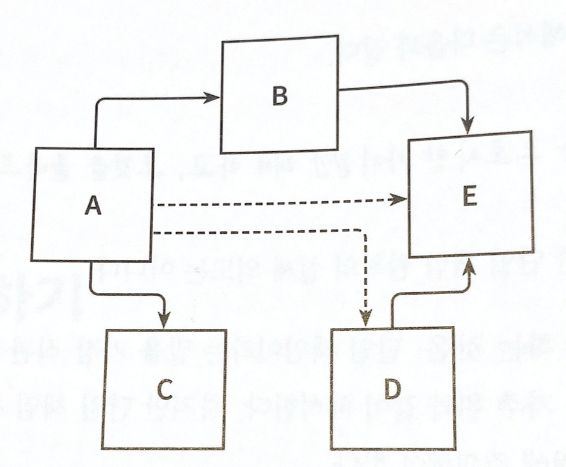
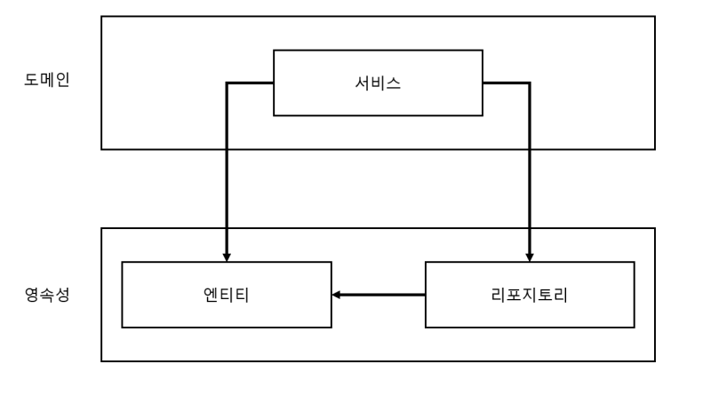
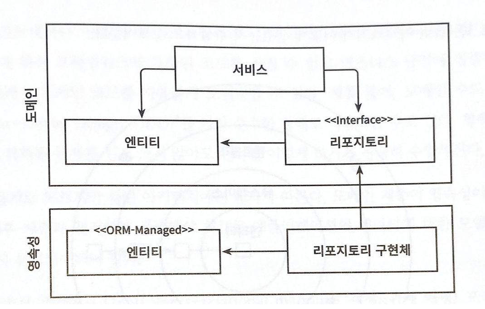
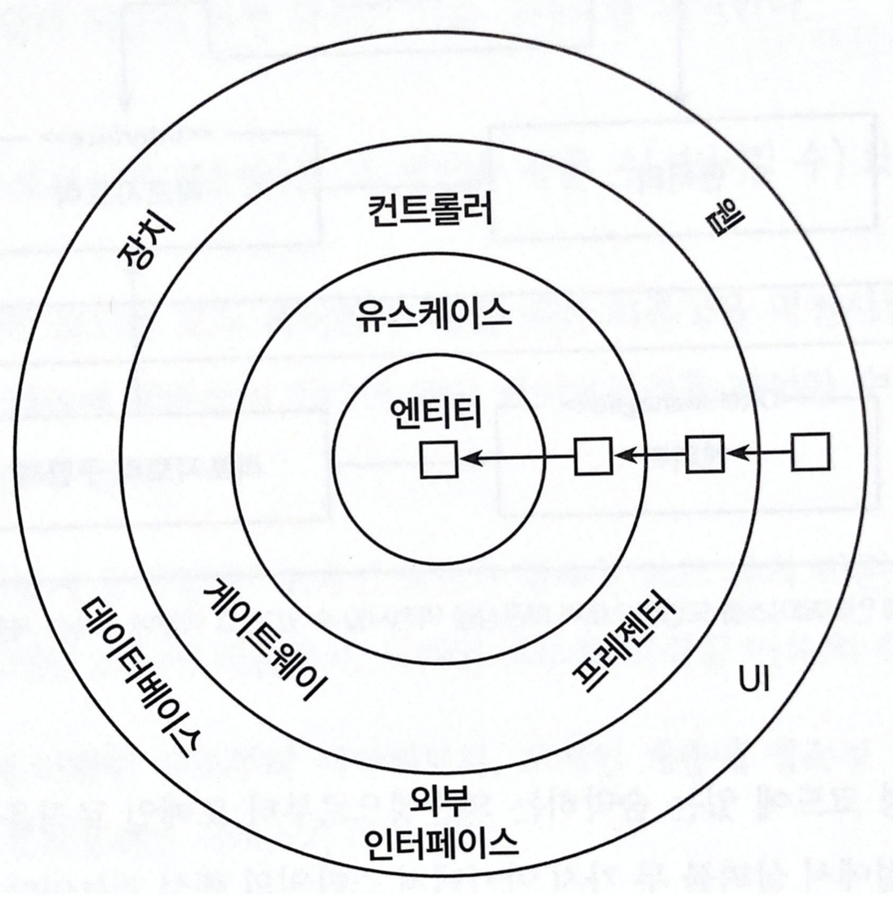
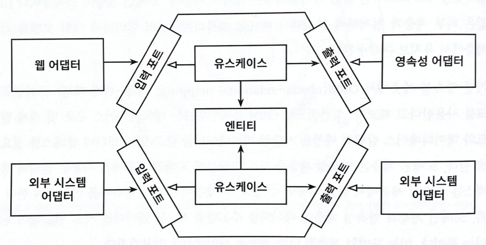

# 2장. 의존성 역전하기

## 단일 책임 원칙

- 단일 책임 원칙(Single Responsibility Principle, SRP)

    > 💡 하나의 컴포넌트는 오로지 한 가지 일만 해야하고, 그것을 올바르게 수행해야 한다.

- 위는 단일 책임 원칙의 일반적이고 직관적인 해석이다. 하지만 여기에는 오해의 소지가 있다. 단일 책임 원칙의 실제 정의는 다음과 같다.

    > 💡 컴포넌트를 변경하는 이유는 오직 하나뿐이어야 한다.

- ‘책임’은 ‘오로지 한 가지 일만 하는 것’보다는 ‘변경할 이유’로 해석해야 한다. 만약 컴포넌트를 변경할 이유가 오로지 한 가지라면 컴포넌트는 딱 한 가지 일만 하게 된다.
- 이것은 아키텍처에서 어떤 의미일까?
- 만약 컴포넌트를 변경할 이유가 한 가지라면 우리가 어떤 다른 이유로 소프트웨어를 변경하더라도 이 컴포넌트에 대해서는 전혀 신경 쓸 필요가 없다. 소프트웨어가 변경되더라도 여전히 우리가 기대한 대로 동작 할 것이기 때문이다.
- 하지만 변경할 이유는 컴포넌트 간 의존성을 통해 쉽게 전파된다.
    
    
    
    어떤 컴포넌트의 의존성 각각은 이 컴포넌트를 변경하는 이유 하나씩에 해당한다. 점선 화살표처럼 전이 의존성(transitive dependency)이라고 하더라도 말이다.
    
- 컴포넌트 A는 여러 컴포넌트에 의존한다. 반면 컴포넌트 E는 의존하는 것이 전혀 없다.
- 컴포넌트 E를 변경할 유일한 이유는 새로운 요구사항에 의해 E의 기능을 바꿔야 할 때 뿐이다. 반면 컴포넌트 A는 모든 컴포넌트에 의존하기 때문에 다른 컴포넌트가 바뀌면 같이 바뀌어야 한다.
- 많은 코드는 단일 책임 원칙을 위반 하므로 시간일 갈 수록 변경이 어려워 지고 변경 비용이 증가한다.
- 변경할 이유는 점점 쌓여가고 이는 한 컴포넌트를 변경하는 것이 다른 컴포넌트가 실패하는 원인이 될 수 있다.

## 부수 효과에 관한 이야기

- 오래된 프로젝트를 유지보수 할 때 코드가 실제로 어떤 일을 하는지 이해가기 쉽지 않고, 코드를 수정했을 때 다른 영역에서 부수효과가 생겼다.
- 클라이언트는 새로운 기능을 요청했고 이를 위해서는 핵심적인 특정 컴포넌트를 변경하는 것이 품질과 비용 측면에서 좋을것이라 제안했다. 하지만 클라이언트는 이전에 해당 컴포넌트를 변경한 적이 있는데 다른 부분에서 많은 문제가 생겼다며 이 작업을 거절 했다. 즉, 변경에 대한 부수 효과를 우려했던 것이다.
- 이는 잘못 구조화된 소프트웨어를 변경하는데 더 많은 비용을 지불하도록 만드는 경우를 보여준다.

## 의존성 역전 원칙

- 계층형 아키텍처에서 계층 간 의존성은 항상 다음 계층인 아래 방향을 가리킨다. 단일 책임 원칙을 적용하면 상위 계층들이 하위 계층들에 비해 변경할 이유가 더 많다는 것을 알 수 있다.
- 즉, 영속성 계층에 대한 도메인 계층의 의존성 때문에 영속성 계층을 변경할 때마다 잠재적으로 도메인 계층도 변경해야한다. 도메인 계층은 애플리케이션에서 핵심 코드이므로 변경 이유가 전이 되게 하고 싶지 않다. 그럼 이 의존성을 어떻게 해결 할 수 있을까?
- 의존성 젹전 원칙(Dependency Inversion Priciple, DIP)이 그 해답이다.

    > 💡 코드상의 어떤 의존성이든 그 방향을 바꿀 수(역전시킬 수) 있다.

- 사실 의존성 양쪽 코드를 모두 제어할 수 있을 때만 의존성을 역전시킬 수 있다. 서드파티 라이브러리에 의존성이 있다면 해당 라이브러리는 제어할 수 없기 때문에 역전 시킬 수 없다.
- 의존성 역전은 어떻게 동작할까? 도메인 코드와 영속성 코드간의 의존성을 역전시켜 영속성 코드가 도메인 코드에 의존하게 하여 도메인 코드의 변경할 이유를 줄이면 된다.
    
    
    
- 1장의 1.2에 나온 구조이다. 도메인 계층에서 영속성 계층을 의존하고 있다.
- 여기서 엔티티는 도메인 객체를 표현하고 도메인 코드는 이 엔티티의 상태를 변경하는 일을 중심으로 하므로 엔티티를 도메인 계층으로 올린다.
- 하지만 이는 영속성 계층의 리포지토리가 도메인 계층의 엔티티에 의존하기 때문에 두 계층 사이에 순환 의존성(circular dependency)이 생긴다. 이 부분이 바로 DIP를 적용하는 부분이다.
- 도메인 계층에 리포지토리에 대한 인터페이스를 만들고, 영속성 계층에서 실제 리포지토리를 구현하게 하는 것이다.
    
    
    
    도메인 계층에 인터페이스를 도입함으로써 의존성을 역전 시킬 수 있고, 그 덕분에 영속성 계층이 도메인 계층에 의존하게 된다.
    

## 클린 아키텍처

- 로버트 C. 마틴은 클린 아키텍처에서는 설계가 비즈니스 규칙의 테스트를 용이하게 하고, 비즈니스 규칙은 프레임워크, 데이터베이스, UI 기술, 그 밖의 외부 애플리케이션이나 인터페이스로부터 독립적일 수 있다고 했다.
- 이는 도메인 코드가 외부로 의존성을 가지는 것이 아니라 모든 의존성이 도메인 코드를 향하게 하는 것이다.
    
    
    
    클린 아키텍처에서 모든 의존성은 도메인 로직을 향해 안쪽 방향으로 향한다.
    
- 이 아키텍처에서 의존성 규칙이 가장 중요하다. 계층간의 모든 의존성으로 안쪽으로 향하는 것이다.
- 코어에는 유스케이스에서 접근하는 도메인 엔티티들이 있다. 유스케이스는 서비스라고 볼 수 있다. 단일책임원칙을 지키기 위해 조금 더 세분화 되어 있다.
- 도메인 코드에서는 어떤 영속성 프레임워크나 UI 프레임워크가 사용 되는지 알 수 없기 때문에 특정 프레임워크에 특화된 코드를 가질 수 없고 비즈니스 규칙에만 집중 할 수 있다. 이는 도메인 코드를 자유롭게 모델링 할 수 있게 해준다.
- 하지만 클린아키텍처에도 단점이 있다. 도메인 계층이 영속성 계층이나 다른 외부계층과 분리되므로 엔티티에 대한 모델을 각 계층에서 유지보수 해야 한다는 것이다.
- 예를 들어 영속성 계층에서 ORM 프레임워크를 사용할 경우, 데이터 베이스 구조 및 객체 필드와 컬럼 매핑 정보등을 담고 있는 엔티티 클래스가 필요하다. 하지만 도메인 계층은 영속성 계층을 모르기 때문에 두 계층에서 각각 엔티티를 생성해야 한다. 즉, 두 계층이 데이터를 주고 받을 때, 두 엔티티를 서로 변환해야 한다는 뜻이다.
- 하지만 이는 바람직한 일이다. 도메인 코드를 프레임워크(여기선 ORM)에 특화된 문제로 부터 해방시키고자 했던, 결합이 제거된 상태이다. 가령 JPA는 엔티티에 기본 생성자가 필수 인데 이는 도메인 모델에는 포함해서는 안 될 프레임워크에 특화된 결합의 예이다.

## 육각형 아키텍처(헥사고날 아키텍처)

- ‘육각형 아키텍처’라는 용어는 알리스테어 콕번이 만든 용어이다.
    
    
    
    육각형 아키텍처는 애플리케이션 코어가 각 어댑터와 상호작용하기 위해 특정 포트를 제공하기 때문에 ‘포트와 어댑터’ 아키텍처라고도 불린다.
    
- 모양은 아무 의미없다. 팔각형 아키텍터라 불러도 상관없다고 한다.
- 육각형 안에는 도메인 엔티티와 상호작용하는 유스케이스가 있다. 육각형에서 외부로 향하는 의존성이 없기 때문에 의존성 규칙이 그대로 적용된다. 모든 의존성은 코어를 향하고 있다.
- 육각형의 바깥에는 여러 어댑터들이 있다. 웹 브라우저와 상호작요하는 웹 어댑터, 데이터베이스와 상호작용 하는 어댑터도 있다.
- 왼쪽에 있는 어댑터들은 (애플리케이션 코어를 호출하기 때문에) 애플리케이션을 주도하는 어댑터들이다.
- 오른쪽에 있는 어댑터들은 (애플리케이션 코어에 의해 호출되기 때문에) 애플리케이션에 의해 주도되는 어댑터들이다.
- 애플리케이션 코어와 어댑터들 간의 통신이 가능하려면 애플리케이션 코어가 각각의 포트를 제공해야 한다.
- 주도하는 어댑터(driving adapter)에게는 그러한 포트가 코어에 있는 유스케이스 클래스들에 의해 구현되고 호출되는 인터페이스가 될 것이고, 주도되는 어댑터(driven adapter)에게는 그러한 포트가 어댑터에 의해 구현되고 코어에 의해 호출되는 인터페이스가 될 것이다.
- 이러한 핵심 개념으로 이 아키텍처는 ‘포트와 어댑터(ports-and-adapters)’ 아키텍처로도 알려져 있다.
- 위의 그림처럼 육각형 아키텍처도 계층으로 구성할 수 있다.
- 가장 바깥쪽 계층은 애플리케이션과 다른 시스템 간의 번역을 담담하는 어댑터로 구성되어 있다.
- 다음으로 포트와 유스케이스 구현체를 결합해서 애플리케이션 계층을 구성할 수 있는데, 이 두가지가 애플리케이션의 인터페이스를 정의하기 때문이다. 마지막 계층에는 도메인 엔티티가 위치한다.

## 유지보수 가능한 소프트웨어를 만드는 데 어떻게 도움이 될까?

- 의존성을 역전시켜 도메인 코드가 다른 바깥쪽 코드에 의존하기 않게 함으로써 영속성과 UI에 특화된 모든 문제로부터 도메인 로직의 결합을 제거하고 코드를 변경할 이유의 수를 줄여준다. 유지보수성은 더 좋아진다.
- 도메인 코드는 비즈니스 문제에만 집중하도록 모델링 될 수 있다.