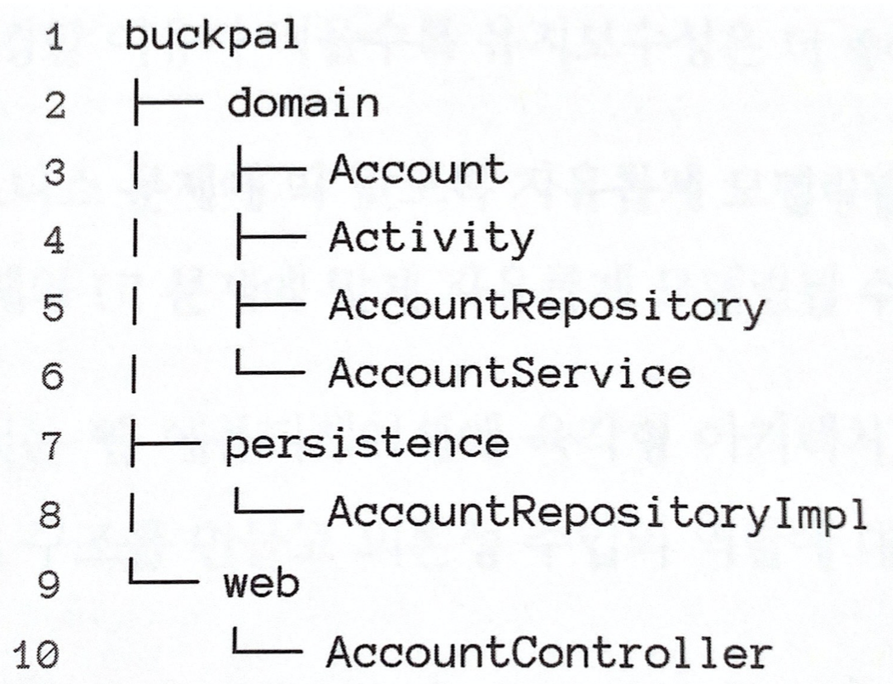
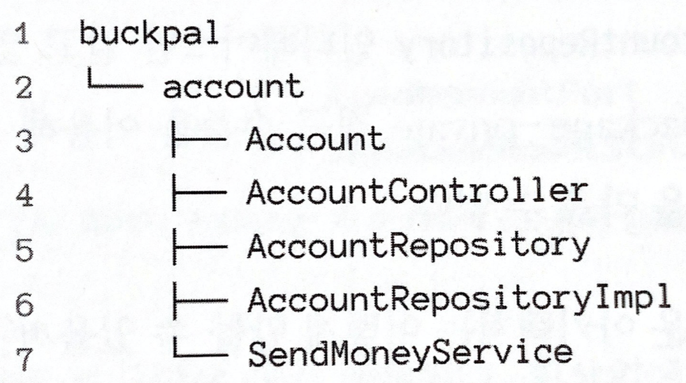
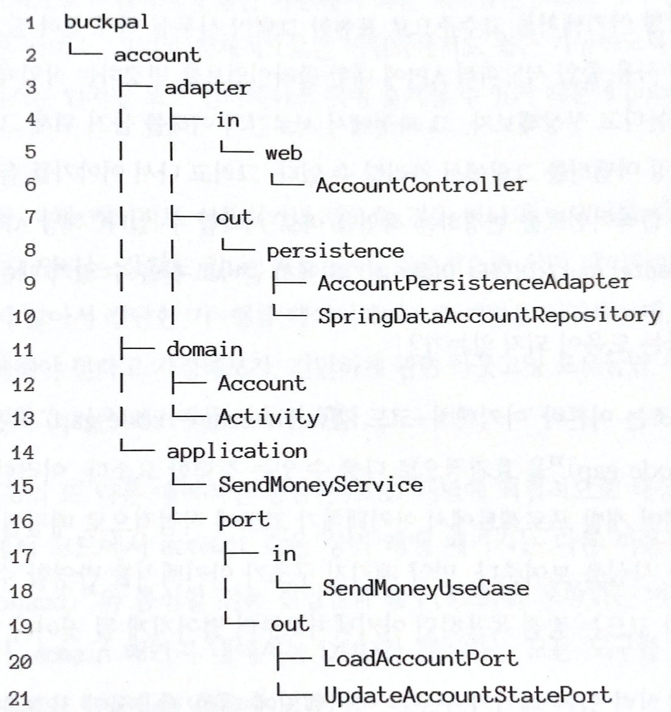
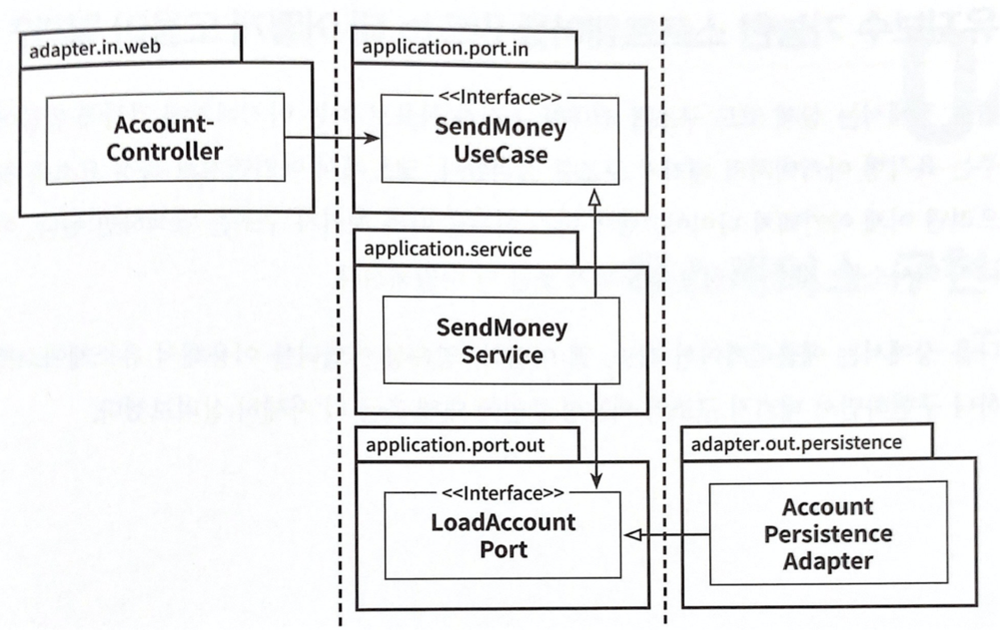

- 코드를 보는 것만으로도 어떤 아키텍처인지 파악할 수 있다면 좋지 않을까?
- 새 프로젝트에서 가장 먼저 제대로 만들려고 하는 것은 패키지 구조다. 괜찮은 구조를 잡고 시작하지만 프로젝트가 진행될수록 점점 바빠지고 패키지 구조는 엉망진창 코드를 그럴싸하게 보이게 만드는 껍데기로 전락한다.한 패키지에 있는 클래스들이 불러오지(import) 말아야 할 다른 패키지에 있는 클래스들을 불러오게 된다.
- 앞으로 ‘송금하기’ 유스케이스를 통해 코드를 구조화하는 방법을 살펴보겠다.

## 계층으로 구성하기

- 코드를 구조화하는 첫 번째 접근법은 계층을 이용하는 것이다.
    
    
    
    계층으로 코드를 구성하면 기능적인 측면들이 섞이기 쉽다.
    
- 웹, 도메인, 영속성 계층에 각각의 패키지를 생성했다.
- 1장에서 이야기한 것처럼 여러 가지 이유로 간단한 구조의 계층은 가장 적합한 구조가 아닐 수 있다.
- 의존성 역전 원칙을 적용해서 의존성이 domain 패키지에 있는 도메인 코드만을 향하도록 해뒀다.
- domain 패키지에 AccountRepository 인터페이스를 추가하고, persistence 패키지에 AccountRepositoryImpl 구현체를 둠으로써 의존성을 역전시켰다.
- 하지만 이 패키지는 세가지 이유로 최적의 구조가 아니다.
- 첫 번째로, 애플리케이션 기능 조각이나 특성을 구분 짓는 패키지 경계가 없다. 이 구조에서 사용자를 관리하는 기능을 추가해야 한다면 web 패키지에 UserController를 추가하고, domain 패키지에 UserService, UserRepository, User를 추가하고 persistence 패키지에 UserRepositoryImpl을 추가하게 될 것이다. 추가적인 구조가 없다면, 서로 연관되지 않은 기능들끼리 예상하지 못한 부수효과를 일으킬 수 있는 클래스들의 엉망진창 묶으로 변모할 가능성이 크다.
- 두 번째로, 애플리케이션이 어떤 유스케이스들을 제공하는 파악할 수 없다. AccountService와 AccountController가 어떤 유스케이스를 구현했는지 파악하기 힘들다. 특정 기능을 찾기 위해서는 어떤 서비스에서 어떤 메소드가 책임을 수행 하는지 직접 찾아야 한다.
- 세 번째로, 패키지 구조를 통해서는 우리가 목표로 하는 아키텍처를 파악 할 수 없다. 어떤 기능이 웹 어댑터에서 호출되는지, 영속성 어댑터가 도메인 계층에 어떤 기능을 제공하는지 한눈에 알아볼 수가 없다. 인커밍(incoming) 포트와 아웃고잉(outgoing) 포트가 코드 속에 숨겨져 있다.

## 기능으로 구성하기

- ‘계층으로 구성하기’ 의 문제점을 해결해 보자.
    
    
    
    기능을 기준으로 코드를 구성하면 기반 아키텍처가 명확하게 보이지 않는다.
    
- 가장 본질적인 변경은 계좌와 관련된 모든 코드를 최상위의 account 패키지에 넣었다는 점이다.
- 각 기능을 묶은 새로운 그룹은 account와 같은 레벨의 새로운 패키지에 넣고, 외부에서 접근되면 안되는 클래스들은 package-private(default 접근지정자) 접근 수준을 이용하여 패키지간 경계를 강화할 수 있다.
- 기존의 AccountService의 책임을 좁히기 위해 SendMoneyService로 클래스명을 바꿨다. 이제 ‘송금하기’ 유스케이스를 클래스명으로만 명확하게 찾을 수 있다. 애플리케이션 기능을 코드로 볼 수 있게 만드는 것을 로버트 마틴이 ‘소리치는 아키텍처(screaming architecture)라고 명명한 바 있다. 코드가 그 의도를 우리에게 소리 치고 있기 때문이다.
- 하지만 기능에 의한 패키징 방식은 계층의 의한 패키징 방식보다 아키텍처의 가시성을 훨씬 더 떨어뜨린다. 어댑터를 나타내는 패키지가 없고, 인커밍 포트, 아웃고잉 포트를 확인 할 수 없다. 게다가 SendMoneyService가 AccountRepository 인터페이스만 알고 구현체는 알 수 없도록 했음에도 불구하고, package-private 접근 수준을 이용해 도메인 코드에서 영속성 코드로 의존하는 것을 막을 수 없다. (package-private는 같은 패키지에 있을 경우 접근 가능하기 때문)

## 아키텍처적으로 표현력 있는 패키지 구조

- 육각형 아키텍처에서 구조적으로 핵심적인 요소는 엔티티, 유스케이스, 인커밍/아웃고잉 포트, 인커밍/아웃고잉 어댑터다.
    
    
    
    아키텍처적으로 표현력 있는 패키지 구조에서는 각 아키텍처 요소들에 정해진 위치가 있다.
    
- 구조의 각요소들은 패키지 하나씩에 직접 매핑된다. 최상위에는 Account와 관련된 유스케이스를 구현한 모듈임을 나타내는 account 패키지가 있다.
- 다음 레벨에는 도메인 모델이 속한 domain 패키지, 서비스 계층을 포함한 application 패키지가 있다. SendMoneyService는 SendMoneyUseCase를 구현하고, 아웃고잉 포트 인터페이스이자 영속성 어댑터에 의핸 구현된 LoadAccountPort와 UpdateAccountStatePort를 사용한다.
- adapter 패키지는 인커밍 어댑터와 아웃고잉 어댑터를 포함한다.
- 이 패키지 구조는 ‘아키텍처-코드 갭’(architecture-code gap) 혹은 ‘모델-코드 갭’(model-code gap)을 효과적으로 다룰 수 있는 강력한 요소다. 이러한 용어는 대부분 소프트웨어 개발 프로젝트에서 아키텍처가 코드에 직접적으로 매핑될 수 없는 추상적인 개념이다.
- 이렇게 표현력 있는 패키지 구조는 아키텍처에 대한 적극적인 사고를 촉진한다. 많은 패키지가 생기고, 현재 작업중인 코드를 어떤 패키지에 넣어야 할지 계속 생각해야 하기 때문이다.
- 패키지가 아주 많다는 것은 모든 것을 public으로 만들어서 패키지 간의 접근을 허용해야 한다는 것을 의미하는 게 아닐까?
- 어댑터 패키지에 있는 클래스들은 반드시 애플리케이션 패키지 내에 있는 포트 인터페이스를 통해서 호출되므로 package-private 접근 수준으로 둘 수 있다. 그러므로 애플리케이션 계층에서 어댑터 클래스로 향하는 의존성은 있을 수 없다.
- 하지만 application, domain 패키지 내의 일부 클래스들은 public으로 지정해야 한다. 의도적으로 어댑터에서 접근 가능해야 하는 포트들은 public이어야 한다. 도메인 클래스들은 서비스, 어댑터에서 접근 가능하도록 public이어야 한다.
- 이 패키지 구조의 다른 장점은 DDD개념에 직접적으로 대응시킬 수 있다는 점이다. account같은 상위 레벨 패키지는 다른 바운디드 컨텍스트(bounded context)와 통신할 전용 진입점과 출구(포트)를 포함하는 바운디드 컨텍스트에 해당한다.
- 완벽한 방법은 없으나 표현력 있는 패키지 구조는 코드와 아키텍처간의 갭을 줄일 수 있게 해준다.

## 의존성 주입의 역할

- 클린 아키텍처의 가장 본질적인 요건은 애플리케이션 계층이 인커밍/아웃고잉 어댑터에 의존성을 갖지 않는 것이다.
- 예제 코드의 웹 어댑터와 인커밍 어댑터에 대해서는 그렇게 하기가 쉽다. 제어 흐름 방향이 어댑터과 도메인 코드간의 의존성 방향과 같기 때문이다. 하지만 영속성 어댑터와 같이 아웃고잉 어댑터에 대해서는 제어 흐름의 반대 방향으로 의존성을 돌리기 위해 의존성 역전 원칙을 사용해야 한다.
- 이를 위해 애플리케이션 계층에 인터페이스를 두고  어댑터에 구현체를 두면 된다. 육각형 아키텍처에서는 이 인터페이스가 포트이다.
- 그런데 이 구현체의 실체 객체를 누가 애플리케이션 계층에 제공해야 할까?
- 이 부분에서 의존성 주입을 활용할 수 있다. 모든 계층에 의존성을 가진 중립적인 컴포넌트를 하나 도입하는 것이다.
    
    
    
    웹 컨트롤러가 서비스에 의해 구현된 인커밍 포트를 호출한다. 서비스는 어댑터에 의해 구현된 아웃고잉 포트를 호출한다.
    
- 중립적인 의존성 주입 컴포넌트는 AccountController, SendMoneyService, AccountPersistenceAdapter 클래스의 인스턴스를 만들 것이다. AccountController가 SendMoneyUserCase 인터페이스가 필요하므로 SendMoneyService 클래스 인스턴스를 주입한다.
- SendMoneyService 인스턴스를 만들 때도 LoadAccountPort 인터페이스로 가장한 AccountPersistence 인스턴스를 주입한다.

## 유지보수 가능한 소프트웨어를 만드는 데 어떻게 도움이 될까?

- 이제 코드에서 아키텍처의 특정 요소를 찾으려면 아키텍처 다이어그램의 박스 이름을 따라 패키지 구조를 탐색하면 된다. 이로써 의사소통, 개발, 유지보수가 조금 더 수월해진다.