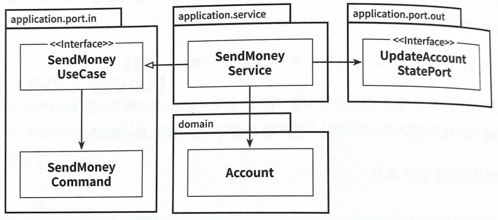

# 4장. 유스케이스 구현하기

- 현재  아키텍처에서 아주 느슨하게 결합돼 있기 때문에 필요한 대로 도메인 코드를 자유롭게 모델링할 수 있다.
- 앞에서 소개한 육각형 아키텍처 스타일로 유스케이스를 구현해보자.
- 육각형 아키텍처는 도메인 중심의 아키텍처에 적합하기 때문에 도메인 엔티티를 만들고 해당 도메인 엔티티를 중심으로 유스케이스를 구현한다.

## 도메인 모델 구현하기

- 송금하는 유스케이스를 구현해보자. 객체지향적인 방식으로 모델링 하는 방법은 입,출금을 할 수 있는 Account 엔티티를 만들고 출금 계좌에서 돈을 출금해서 입금 계좌로 돈을 입금하는 것이다.

```java
package buckpal.domain;

public class Account {
		private AccountId id;
		private Money baselineBalance;
		private ActivityWindow activityWindow;
	
		public Money calculateBalance() {
			return Money.add(
					this.baselineBalance,
					this.activityWindow.calculateBalance(this.id));
		}

		public boolean withdraw(Money money, AccountId targetAccountId) {
	
			if (!mayWithdraw(money)) {
				return false;
			}
	
			Activity withdrawal = new Activity(
					this.id,
					this.id,
					targetAccountId,
					LocalDateTime.now(),
					money);
			this.activityWindow.addActivity(withdrawal);
			return true;
		}

		private boolean mayWithdraw(Money money) {
			return Money.add(
					this.calculateBalance(),
					money.negate())
					.isPositiveOrZero();
		}

		public boolean deposit(Money money, AccountId sourceAccountId) {
			Activity deposit = new Activity(
					this.id,
					sourceAccountId,
					this.id,
					LocalDateTime.now(),
					money);
			this.activityWindow.addActivity(deposit);
			return true;
		}
}
```

- Account 엔티티는 실제 계좌의 현재 스냅샷을 제공한다. 계좌에 대한 모든 입금과 출금은 Activity 엔티티에 포착된다. 한 계좌의 모든 활동을 한번에 메모리에 올리지 않고 ActivityWindow 값 객체(value object)에서 포착한 지난 며칠 혹은 몇 주간 범위에 해당하는 활동만 보유한다.
- 계좌의 현재 잔고를 계산하기 위해서 Account 엔티티는 ActivityWindow의 첫번째 활동 바로 전의 잔고를 표현하는 baselineBalance속성을 가지고 있다. 현재 총 잔고는 기준 잔고(baselineBalance)에 활동창의 모든 활동들의 잔고를 합한 값이 된다.
- 이 모델 덕분에 계좌에서 일어나는 입금과 출금 각각 withdraw()와 deposit()처럼 새로운 활동을 활동창에 추가하는 것이다. 출금하기 전에는 잔고를 초과하는 금액을 출금할 수 없도록 하는 규칙(mayWithdraw())을 검사한다.
- 이 Account 엔티티를 중심으로 유스케이스를 구현하기 위해 바깥 방향으로 나갈 수 있다.

## 유스케이스 둘러보기

- 일반적으로 유스케이스는 다음과 같은 단계를 따른다.
    1. 입력을 받는다.
    2. 비즈니스 규칙을 검증한다.
    3. 모델 상태를 조작한다.
    4. 출력을 반환한다.
- 유스케이스는 인커밍 어댑터로부터 입력을 받는다. 그리고 유스케이스는 비즈니스 규칙을 검증할 책임이 있다. 그리고 도메인 엔티티와 책임을 공유한다.
- 비즈니스 규칙을 충족하면 입력을 기반으로 모델의 상태를 변경한다. 일반적으로 도메인 객체의 상태를 바꾸고 영속성 어댑터를 통해 구현된 포트로 전달하여 저장하거나 또다른 아웃고잉 어댑터를 호출할 수 있다.
- 아웃고잉 어댑터에서 온 출력값을, 유스케이스로 호출한 어댑터로 반환하기 위해 출력 객체로 변환한다.
- 이러한 단계를 고려하여 ‘송금하기’ 유스케이스 코드를 확인해보자.

```java
package buckpal.application.service;

@RequiredArgsConstructor
@Transactional
public class SendMoneyService implements SendMoneyUseCase {

	private final LoadAccountPort loadAccountPort;
	private final AccountLock accountLock;
	private final UpdateAccountStatePort updateAccountStatePort;

	@Override
	public boolean sendMoney(SendMoneyCommand command) {
		// TODO: 비즈니스 규칙 검증
		// TODO: 모델 상태 조작
		// TODO: 출력 값 반환
	}
}
```

- 서비스는 인커밍 포트 인터페이스인 SendMoneyUseCase를 구현하고, 계좌를 불러오기 위해 LoadAccountPort를 호출한다. 그리고 계좌 상태를 업데이트 하기 위해 UpdateAccountStatePort를 호출 한다.
    
    
    
    하나의 서비스가 하나의 유스케이스를 구현하고, 도메인 모델을 변경하고, 저장하기 위해 아웃고잉 포트를 호출한다.
    
- // TODO로 남겨진 부분을 살펴보자.

## 입력  유효성 검증

- 입력 유효성 검증은 어디에서 해야할까? 어댑터에서 한다면 유스케이스에서는 검증이 된것이라 믿을 수 있을까? 또 하나의 유스케이스를 여러 어댑터에서 호출 할 수 있는데 그러면 각 어댑터에서 유효성 검증을 모두 구현 해야한다.
- 애플리케이션 계층에서 입력 유효성 검증을 해야하는 이유는, 그렇게 하지 않을 경우 애플리케이션 코어의 바깥쪽부터 유효하지 않은 입력값을 받게 되고 모델의 상태를 해칠 수 있기 때문이다.
- 유스케이스 클래스가 아니라면 어디서 유효성 검증을 해야할까?
- 입력모델(input model)이 이 문제를 다루도록 해보자. ‘송금하기’ 유스케이스에서 입력모델은 SendMoneyCommand 클래스다. 해당 클래스의 생성자 내에서 입력 유효성을 검증할 것이다.
- 

```java
package buckpal.application.port.in;

@Getter
public class SendMoneyCommand {
		private final AccountId sourceAccountId;
		private final AccountId targetAccountId;
		private final Money money;
	
	  public SendMoneyCommand(
	          AccountId sourceAccountId,
	          AccountId targetAccountId,
	          Money money) {
	      this.sourceAccountId = sourceAccountId;
	      this.targetAccountId = targetAccountId;
	      this.money = money;
	      requireNonNull(sourceAccountId);
	      requireNonNull(targetAccountId);
	      requireNonNull(money);
	      requireGreaterThan(money, 0);
	  }
}
```

- 송금을 위해서는 출금 계좌와 입금 계좌의 ID, 송금금액이 필요하다. null이 아니거나 0보다 커야한다. 하나라도 위배될 경우 예외를 던져 객체 생성을 막으면 된다.
- SendMoneyCommand 필드에 final을 지정해 불변 필드로 만들었다. 이는 생성 후 상태는 유효하고 변경할 수 없다는 것을 보장한다.
- SendMoneyCommand는 유스케이스 API의 일부이기 때문에 인커밍 포트 패키지에 위치한다. 따라서 유효성 검증은 애플리케이션 코어에 있지만 유스케이스 코드를 오염시키지는 않는다.
- 위의 코드를 유효성 검증 표준 라이브러리인 Bean Validation API를 사용하여 조금 고쳐보자.

```java
package buckpal.application.port.in;

@Getter
public class SendMoneyCommand {

		@NotNull
    private final AccountId sourceAccountId;

    @NotNull
    private final AccountId targetAccountId;

    @NotNull
    private final Money money;

    public SendMoneyCommand(
            AccountId sourceAccountId,
            AccountId targetAccountId,
            Money money) {
        this.sourceAccountId = sourceAccountId;
        this.targetAccountId = targetAccountId;
        this.money = money;
	      requireGreaterThan(money, 0);
        this.validateSelf();
    }
}
```

- SelfValidating 추상 클래스는 validateSelf() 메서드를 제공하며, 생성자 코드의 마지막 문장에서 이 메서드를 호출하고 있다. 이 메서드가 필드에 지정된 @NonNull을 검증하고 위반한 경우 예외를 던진다. 물론 송금액이 0보다 큰지 검사했던 것처럼 직접 구현할 수도 있다.
- 입력 모델의 유효성 검증 코드를 통해 유스케이스 구현체 오류 방지 계층(anti corrption layer)을 만들었다. 여기서의 계층은 아키텍처에서의 계층이 아니라 잘못된 입력을 돌려주는 유스케이스 보호막을 의미한다.

## 생성자의  힘

- 입력 모델인 SendMoneyCommand는 생성자에 많은 책임을 지우고 있다. 클래스가 불변이기 때문에 생성자의 인자 리스트에는 클래스의 각 속성에 해당하는 파라미터들이 포함돼 있다. 또한 생성자가 파라미터의 유효성 검증까지 하기 때문에 유효하지 않은 상태의 객체를 만드는 것은 불가능하다.
- 예제 코드의 생성자에는 3개의 파라미터만 있다. 만약 더 많아 질 경우 어떻게 할까? 빌더(Builder) 패턴을 활용하면 더 편하게 사용할 수 있지 않을까? 생성자를 private으로 만들고 빌더의 builder() 메서드 내부에 생성자 호출을 숨길 수 있다.
    
    ```java
    new SendMoneyCommandBuilder()
    	.sourceAccountId(new AccountId(41L))
    	.targetAccountId(new AccountId(42L))
    	// ...
    	.build();
    ```
    
- 유효성 검증 로직은 생성자에 그대로 둬서 빌더가 유효하지 않은 상태의 객체를 생성하지 못하도록 막을 수 있다.
- 만약 새로운 필드를 추가 해야 하는 상황에서 깜빡하고 빌더를 호출 하는 코드에 새로운 필드를 추가 하는 것을 잊었다면 컴파일러는 이를 알아차리고 경고 해주지 못한다. 물론 런타임시 에러를 던지긴 하겠지만 말이다.
- 만약 생성자를 직접 사용했다면 컴파일 에러가 발생하고 실수를 줄일 수 있을것이다.
- 이 정도면 컴파일러가 우리를 이끌도록 놔둬도 되지 않을까?

## 유스케이스마다 다른 입력 모델

- 각기 다른 유스케이스에 동일한 입력 모델을 사용하고 싶을 수 있다. 예를 들어 ‘계좌 등록하기’와 ‘계좌 정보 업데이트하기’라는 두 가지 유스케이스를 보자. 두가지 모두 계좌 상세 정보가 필요하다.
- 차이점은 ‘계좌 정보 업데이트하기’는 업데이트 할 계좌 ID가 필요하고, ‘계좌 등록하기’는 계좌 소유자 ID가 필요하다는 것이다. 같은 입력모델을 공유하면 ‘계좌 정보 업데이트하기’는 소유자의 ID ‘계좌 등록하기’는 계좌 ID에 null 값을 허용해야 한다.
- 불변 객체의 필드에 대해서 null을 허용하는 것은 그 자체로 코드 냄새(code smell)이다. 하지만 어떻게 유효성 검사를 하느냐가 더 문제다. 각각 다른 유효성 검증 로직이 필요하기 때문에 비즈니스 코드를 유효성 검증코드로 오염시키게 된다.

## 비즈니스 규칙 검증하기

- 입력 유효성 검증은 아니지만 비즈니스 규칙 검증은 유스케이스 로직의 일부이다. 언제 각각의 규칙을 검증해야 할까?
- 둘 사이의 실용적인 구분점은 비즈니스 규칙을 검증하는 것은 도메인 모델의 현재 상태에 접근해야 하는 반면, 입력 유효성 검증은 그럴 필요가 없다는 것이다.
- 입력 유효성을 검증하는 것은 **구문상의(syntactical)** 유효성을 검증하는 것이라 할 수 있고, 브즈니스 규칙은 유스케이스의 맥락 속에서 **의미적인(semantical) 유효성을 검증하는 일이라 할 수 있다.**
- “출금 계좌는 초과 출금 되어서는 안 된다.”라는 규칙은 모델의 현재 상태에 접근해야 확인 할 수 있기 때문에 비즈니스 규칙이다.
- 반대로 “송금 되는 금액은 0보다 커야한다.”라는 규칙은 모델에 접근하지 않고도 검증 될 수 있기 때문에 입력 유효성 검증으로 구현할 수 있다.
- 물론 송금액도 비즈니스 규칙으로 다뤄야 한다고 할 수 있지만 단순히 모델 상태의 접근 여부로 검증의 위치를 판단 할 수 있기 때문에 유지보수 측면에서도 유리하다.
- 그러면 비즈니스 규칙은 어떻게 구현할까? 가장 좋은 방법은 비즈니스 규칙을 도메인 엔티티에 넣는 것이다.
    
    ```java
    package buckpal.domain;
    
    public class Account {
    		
    		// ...
    
    		public boolean withdraw(Money money, AccountId targetAccountId) {
    			if (!mayWithdraw(money)) {
    				return false;
    			}
    	
    			// ...
    		}
    }
    ```
    
- 물론 유스케이스 코드에서 도메인 엔티티를 사용하기 전에 해도 된다.
    
    ```java
    package buckpal.application.service;
    
    @RequiredArgsConstructor
    @Transactional
    public class SendMoneyService implements SendMoneyUseCase {
    
    	// ...
    
    	@Override
    	public boolean sendMoney(SendMoneyCommand command) {
    		requireAccountExists(command.getSourceAccountId());
    		requireAccountExists(command.getTargetAccountId());
    		// ...
    	}
    }
    ```
    
- 유효성 검증 코드를 호출하고, 실패할 경우 적절한 예외를 던진다.
- 유효성 검증은 단순히 계좌가 데이터베이스에 있는 지 확인 하는 것이었다. 비즈니스 규칙은 데이터베이스에서 도메인 모델을 로드해서 상태를 검증해야 할 수도 있다. 어쨌든 도메인 모델을 로드해야 한다면 도메인 엔티티 내에 비즈니스 규칙을 구현해야 한다.

## 풍부한  도메인 모델 vs. 빈약한 도메인 모델

- 도메인 모델을 구현하는 방법에는 크게 DDD 철학을 따르는 풍부한 도메인 모델(rich domain model)과, 빈약한 도메인 모델(anemic domain model)이 있다. 어느것이 옳다는 정답은 없으며 각자의 스타일에 맞게 사용할 수 있다.
- 풍부한 도메인 모델은 애플리케이션의 코어에 있는 엔티티에서 가능한 많은 도메인 로직이 구현된다. 엔티티들은 상태를 변경하는 메서드를 제공하고, 비즈니스 규칙에 유효한 변경만을 허용한다.
- 이전에 봤던 유스케이스는 도메인 모델의 진입점으로 동작한다. 유스케이스는 사용자의 의도만 표현하고 실제 작업은 도메인 엔티티의 메소드에서 진행한다. 많은 비즈니스 규칙이 유스케이스 구현체 대신 엔티티에 위치한다.
- ‘송금하기’ 유스케이스 서비스는 출금 계좌와 입금 계좌 엔티티르 로드하고, withdraw(), deposit() 메서드를 호출한 후, 결과를 다시 데이터베이스로 보낸다.
- 빈약한 도메인 모델에서는 엔티티 자체가 굉장히 얇다. 필드와 getter, setter 메서드만 포함한다. 즉, 도메인 로직이 유스케이스 클래스에 구현돼 있다는 것이다. 비즈니스 규칙 검증, 엔티티 상태변경, 아웃고잉 포트에 엔티티 전달할 책임 등이 유스케이스 클래스에 있다.

## 유스케이스마다 다른 출력 모델

- 유스케이스의 작업이 완료되면 호출자에게 무엇을 반환해야 할까? 유스케이스에 맞게 구체적이고 꼭 필요한 데이터만 들고 있어야 한다.
- ‘송금하기’ 유스케이스에서는 boolean 값 하나를 반환했다. 가장 구체적인 최소한의 값이다.
- 송금 후 업데이트 된 Account를 통째로 반환하고 싶다면 어떻게 해야 할까? 라는 질문에는 사실 정답은 없다. 그러나 유스케이스를 가능한 구체적으로 유지하기 위해 계속 질문을 해야 하고, 그래도 의심스러울 경우 가능한 적게 반환하자.
- 유스케이스들이 같은 출력 모델을 공유하면 유스케이스들도 강하게 결합된다. 출력 모델에 새로울 필드가 생기면 공유하는 모든 유스케이스에서 처리를 해야한다. 단일 책임 원칙을 적용하고 모델을 분리해서 유지하는게 결합을 제거하는데 도움이 된다.

## 읽기 전용 유스케이스는 어떨까?

- 읽기 전용 유스케이스는 어떻게 구현할까? 만약 계좌의 잔액을 표시해야 한다고 할 경우 새로운 유스케이스를 구현해야 할까?
- 읽기 전용 작업을 유스케이스라고 언급하는것은 이상하다. 애플리케이션 코어의 관점에서 이 작업은 간단한 데이터 쿼리다. 따라서 유스케이스로 간주되지 않는다면 쿼리로 구현할 수 있다.
- 쿼리를 위한 인커밍 전용 포트를 만들고 이를 ‘쿼리 서비스(query service)’에 구현 하는 것이다.
- 

```java
package buckpal.application.service;

@RequiredArgsConstructor
class GetAccountBalanceService implements GetAccountBalanceQuery {

	private final LoadAccountPort loadAccountPort;

	@Override
	public Money getAccountBalance(AccountId accountId) {
		return loadAccountPort.loadAccount(accountId, LocalDateTime.now())
				.calculateBalance();
	}
}
```

- 쿼리 서비는 유스케이스 서비스와 동일한 방식으로 동작한다. GetAccountBalanceQuery라는 인커밍 포트를 구현하고, LoadAccountPort라는 아웃고잉 포트를 호출한다.
- 읽기 전용 쿼리는 쓰기가 가능한 유스케이스와 명확하게 구분된다. 이런 방식은 CQS(Command-Query Separation)이나 CQRS(Command-Query Responsibility Segregation) 같은 개념과 아주 잘 맞는다.

## 유지보수 가능한 소프트웨어를 만드는 데 어떻게 도움이 될까?

- 입출력 모델을 독립적으로 모델링하면 원치 않는 부수효과를 피할 수 있다. 유스케이스별로 모델을 만들면 유스케이스를 명확하게 이해할 수 있고, 유지보수가 쉽다. 꼼꼼한 입력 유효성 검증, 유스케이스별 입출력 모델은 지속 가능한 코드를 만드는데 큰 도움이 된다.