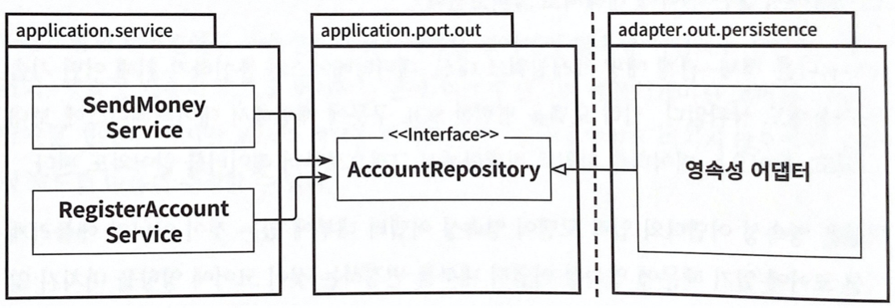

# 6장. 영속성 어댑터 구현하기

## 의존성 역전


코어의 서비스가 영속성 어댑터에 접근하기 위해 포트를 사용한다.

- 애플리케이션 서비스에서 영속성 기능을 사용하기 위해 포트 인터페이스를 호출한다. 이 포트는 영속성 작업을 수행하고 데이터베이스와 통신할 책임을 가진 영속성 어댑터 클래스에서 구현된다.
- 육각형 아키텍처에서 영속성 어댑터는 ‘주도되는’ 또는 ‘아웃고잉’ 어댑터다. 애플리케이션에서 호출만 될 뿐이다.
- 포트는 애플리케이션 서비스와 영속성 코드 사이의 간접적 계층이다. 영속성 계층에 대한 의존성을 없애기 위해 간접 계층을 추가한 것이다.
- 런타임 의존성도 애플리케이션 코어에서 영속성 어댑터로 향한다. 즉 포트라는 인터페이스로 추상화 하여 서비스 계층에서는 영속성 어댑터의 구현체는 신경 쓰지 않고 사용할 수 있고, 영속성 어댑터의 구현체도 서비스 계층에 영향을 전혀 주지 않고 수정하거나 변경할 수 있다.

## 영속성 어댑터의 책임

- 영속성 어댑터가 하는 일을 알아 보자.
    1. 입력을 받는다.
    2. 입력을 데이터 베이스 포맷으로 매핑한다.
    3. 입력을 데이터 베이스로 보낸다.
    4. 데이터 베이스 출력을 애플리케이션 포맷으로 매핑한다.
    5. 출력을 반환한다.
- 영속성 어댑터는 포트 인터페이스를 통해 입력 받는다. 입력 모델은 인터페이스에 맞는 도메인 엔티티나 특정 데이터베이스 연산 전용 객체가 될 것이다.
- 영속성 어댑터는 데이터베이스를 쿼리하거나 변경할 수 있는 포맷으로 입력 모델을 매핑한다. 예를 들어, JPA를 사용할 경우 JPA엔티티로 매핑할 것이다. 또한 다른 기술을 사용해도 상관없다.
- 영속성 어댑터의 입력 모델이 영속성 어댑터 내부에 있는 것이 아니라 애플리케이션 코어에 있기 때문에 영속성 어댑터 내부를 변경하는 것은 코어에 영향을 미치지 않는다.
- 영속성 어댑터는 데이터베이스에 쿼리를 날리고 결과를 받아온다.
- 마지막으로 응답을 포트에 정의된 출력 모델로 매핑해서 반환한다. 출력 모델이 영속성 어댑터가 아니라 애플리케이션 코어에 위치 하는 것이 중요하다.

## 포트  인터페이스 나누기

- 일반적으로 특정 엔티티가 필요로 하는 모든 데이터베이스 연산을 하나의 인터페이스에 넣어 두는 게 일반적인 방법이다.
    
    
    
    하나의 아웃고잉 포트 인터페이스에 모든 데이터베이스 연산을 모아두면 모든 서비스가 실제로는 필요하지 않은 메서드에 의존하게 된다.
    
- 각 서비스는 인터페이스에서 단 하나의 메서드만 사용하더라고 하나의 ‘넓은’포트 인터페이스에 의존성을 갖게 된다. 불필요한 의존성이다.
- 불필요한 메서드에 대한 의존성은 코드를 이해하고 테스트 하기 어렵게 만든다. 인터페이스의 많은 메서드 중 하나만 의존하고 있는 서비스의 단위 테스트를 작성 할 경우 서비스가 어떤 메서드를 호출하는지 찾아야한다.

  > 💡 필요없는 화물을 운반하는 무언가에 의존하고 있으면 예상하지 못했던 문제가 생길 수 있다. - 로버트 C. 마틴

- 인터페이스 분리 원칙(Interface Segregation Principle, ISP)은 클라이언트가 오로지 자신이 필요로 하는 메서드만 알면 되도록 넓은 인터페이스를 특화된 인터페이스로 분리해야 한다고 설명했다.
    
    
    
    인터페이스 분리 원칙을 적용하면 불필요한 의존성을 제거하고 기존 의존성을 눈에 더 잘 띄게 만들 수 있다.
    
- 이제 각 서비스는 실제 필요한 메서드에만 의존한다. 이렇게 좁은 포트를 만드는 것은 코딩을 플러그 앤 플레이(plug - and - play) 경험으로 만든다. 서비스 코드에서 필요한 포트에 ‘꽂기만’ 하면 된다.

## 영속성 어댑터 나누기

- 영속성 어댑터도 하나만 생성하라는 규칙은 없다.
    
    
    
    하나의 애그리거트당 하나의 영속성 어댑터를 만들어서 여러 개의 영속성 어댑터를 만들 수도 있다.
    
- 이렇게 하면 영속성 어댑터들은 각 영속성 기능을 이용하는 도메인 경계를 따라 자동으로 나눠진다.
- 도메인 코드는 영속성 포트를 어떤 클래스가 구현 했는지는 관심이 없다.
- ‘애그리거트당 하나의 영속성 어댑터’ 접근 방식 또한 나중에 여러 개의 바운디드 컨텍스트(bounded context)의 영속성 요구사항을 분리하기 위한 좋은 토대가 된다.
    
    
    
    바운디드 컨텍스트 간의 경계를 명확하게 구분하고 싶다면 각 바운디드 컨텍스트가 영속성 어댑터를 하나씩 가지고 있어야한다.
    
- ‘바운디드 컨텍스트’라는 표현은 경계를 암시한다. account 맥락의 서비스는 billing 맥락의 영속성 어댑터에 접근하지 않고, 그 반대도 마찬가지 이다. 다른 맥락에 있는 무엇인가를 필요한다고 전용 인커밍 포트를 통해 접근해야 한다.

## 스프링 데이터 JPA 예제

- 스프링 데이터 JPA를 사용할 것이므로 계좌의 @Entity 클래스도 필요하다.

```java
package buckpal.adapter.persistence;

@Entity
@Table(name = "account")
@Data
@AllArgsConstructor
@NoArgsConstructor
class AccountJpaEntity {

	@Id
	@GeneratedValue
	private Long id;

package buckpal.adapter.persistence;}
```

```java
package buckpal.adapter.persistence;

@Entity
@Table(name = "activity")
@Data
@AllArgsConstructor
@NoArgsConstructor
class ActivityJpaEntity {

	@Id @GeneratedValue
	private Long id;

	@Column private LocalDateTime timestamp;
	@Column private Long ownerAccountId;
	@Column private Long sourceAccountId;
	@Column private Long targetAccountId;
	@Column private Long amount;
}
```

- Account와 Activity 엔티티를 작성했다. 계좌 엔티티는 일단 ID하나로 구성되어 있다.
- AccountRepository 인터페이스 이다.

```java
interface AccountRepository extends JpaRepository<AccountJpaEntity, Long> {
}
```

- 다음은 ActivityRepository 코드다.

```java
interface ActivityRepository extends JpaRepository<ActivityJpaEntity, Long> {

	@Query("select a from ActivityJpaEntity a " +
			"where a.ownerAccountId = :ownerAccountId " +
			"and a.timestamp >= :since")
	List<ActivityJpaEntity> findByOwnerSince(
			@Param("ownerAccountId") Long ownerAccountId,
			@Param("since") LocalDateTime since);

	@Query("select sum(a.amount) from ActivityJpaEntity a " +
			"where a.targetAccountId = :accountId " +
			"and a.ownerAccountId = :accountId " +
			"and a.timestamp < :until")
	Long getDepositBalanceUntil(
			@Param("accountId") Long accountId,
			@Param("until") LocalDateTime until);

	@Query("select sum(a.amount) from ActivityJpaEntity a " +
			"where a.sourceAccountId = :accountId " +
			"and a.ownerAccountId = :accountId " +
			"and a.timestamp < :until")
	Long getWithdrawalBalanceUntil(
			@Param("accountId") Long accountId,
			@Param("until") LocalDateTime until);

}
```

- 스프링 부트(Spring Boot)는 이 리포지토리를 자동으로 찾고, 스프링 데이터는 실제로 데이터베이스와 통신하는 구현제를 제공한다. (구현 프록시 객체를 생성해주고 런타임시 의존성을 가지게 된다. 자세한건 영한님 강의에서)
- 엔티티와 리포지토리를 만들었으니 영속성 기능을 제공하는 영속성 어댑터를 구현해보자.

```java
@RequiredArgsConstructor
@PersistenceAdapter
class AccountPersistenceAdapter implements
		LoadAccountPort,
		UpdateAccountStatePort {

	private final SpringDataAccountRepository accountRepository;
	private final ActivityRepository activityRepository;
	private final AccountMapper accountMapper;

	@Override
	public Account loadAccount(
					AccountId accountId,
					LocalDateTime baselineDate) {

		AccountJpaEntity account =
				accountRepository.findById(accountId.getValue())
						.orElseThrow(EntityNotFoundException::new);

		List<ActivityJpaEntity> activities =
				activityRepository.findByOwnerSince(
						accountId.getValue(),
						baselineDate);

		Long withdrawalBalance = orZero(activityRepository
				.getWithdrawalBalanceUntil(
						accountId.getValue(),
						baselineDate));

		Long depositBalance = orZero(activityRepository
				.getDepositBalanceUntil(
						accountId.getValue(),
						baselineDate));

		return accountMapper.mapToDomainEntity(
				account,
				activities,
				withdrawalBalance,
				depositBalance);

	}

	private Long orZero(Long value){
		return value == null ? 0L : value;
	}

	@Override
	public void updateActivities(Account account) {
		for (Activity activity : account.getActivityWindow().getActivities()) {
			if (activity.getId() == null) {
				activityRepository.save(accountMapper.mapToJpaEntity(activity));
			}
		}
	}

}
```

- 영속성 어댑터는 LoadAccountPort, UpdateAccountStatePort 2개의 포트를 구현했다.
- AccountRepository로 계좌를 불러온 후 ActivityRepository로 특정 기간의 활동을 가져온다.
- 유효한 Account 도메인 엔티티를 생성하려면 활동창 시작 직전의 잔고가 필요하다. 그래야 데이터 베이스로부터 모든 입,출금 정보를 가져와 합할 수 있다. 모든 데이터를 Account 도메인 엔티티에 매핑하고 반환한다.
- 계좌의 상태를 업데이트 하기 위해서는 Account엔티티 모든 활동을 순회하며 ID가 있는지 확인해야 한다. 없으면 새로운 활동이므로 ActivityRepository를 이용해 저장한다.

## 데이터 베이스 트랜잭션은 어떻게 해야 할까?

- 트랜잭션 경계는 어디에 위치 시켜야 할까?
- 트랜잭션은 하나의 특정한 유스케이스에 대해서 일어나는 모든 쓰기 작업에 걸쳐 있어야 한다. 그래야 하나라도 실패할 경우 모두 롤백이 될 수 있기 때문이다.
- 영속성 어댑터는 어떤 데이터베이스 연산이 같은 유스케이스에 포함되는지 알지 못하기 때문에 언제 트랜잭션을 열고 닫을 지 결정할 수 없다. 이 책임은 영속성 어댑터 호출을 관장하는 서비스에 위임해야 한다.
- 가장 쉬운 방법은 @Transactional 애너테이션으로 감사는 것이다.

## 유지보수 가능한 소프트웨어를 만드는 데 어떻게 도움이 될까?

- 도메인 코드에 플러그인처럼 동작하는 영속성 어댑터를 만들면 도메인 코드가 영속성과 관련된 것들로부터 분리되어 풍부한 도메인 모델을 만들 수 있다.
- 좁은 포트 인터페이스를 사용하면 포트마다 다른 방식으로 구현 할 수 있다. 서비스는 포트만 알면되기 때문에 어댑터는 어떠한 방법을 사용해서 구현을 할 수 있다.