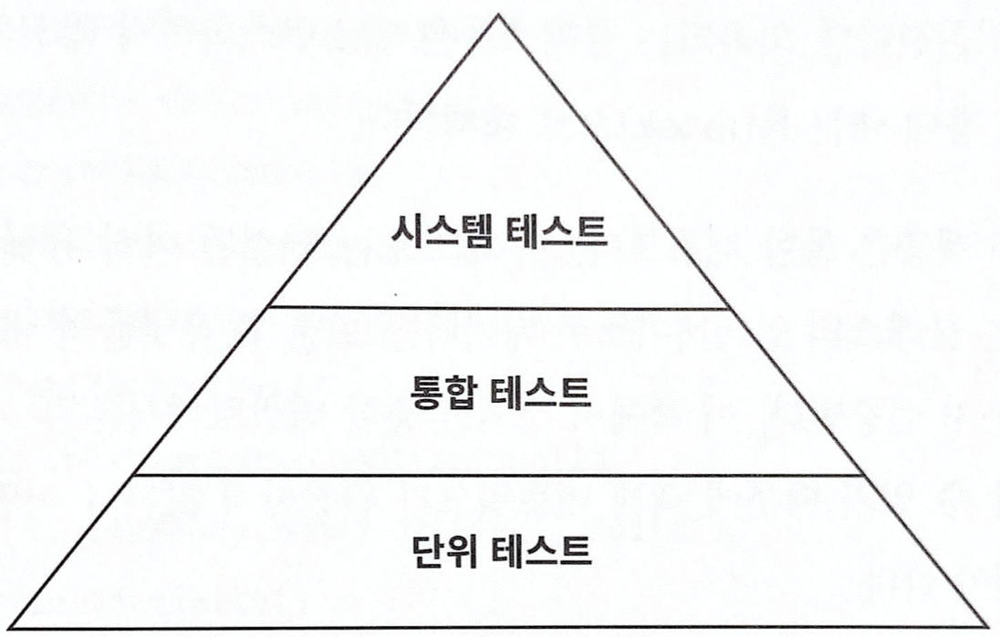

# 7장. 아키텍처 요소 테스트 하기

## 테스트 피라미드



테스트 피라미드에 따르면 비용이 많이 드는 테스트는 지양하고 비용이 적게 드는 테스트를 많이 만들어야 한다.

- 만드는 비용이 적고, 유지보수하기 쉽고, 빨리 실행되고, 안정적인 작은 크기의 테스트들에 대해 높은 커버리지를 유지해야 한다. 이 테스트는 단위 테스트이다.
- 단위 테스트는 피라미드의 토대에 해당한다. 일반적으로 하나의 클래스를 인스턴스화 하고 해당 클래스의 인터페이스를 통해 기능들을 테스트한다. 혹 다른 클래스에 의존하면 목(mock)으로 대체하여 사용한다.
- 다음 계층은 통합 테스트다. 연결된 여럿 유닛을 인스턴스화 하고 시작점이 되는 클래스의 인터페이스로 데이터를 보낸 후 유닛들의 네트워크가 기대한대로 잘 동작하는지 검증한다.
- 마지막으로 시스템 테스트는 애플리케이션을 구성하는 모든 객체 네트워크를 가동시켜 특정 유스케이스가 전 계층에서 잘 동작하는지 검증한다.

## 단위 테스트로 도메인 엔티티 테스트하기

- 먼저 육각형 아키텍처의 중심인 도메인 엔티티를 테스트하자. Account의 상태는 과거 특정 시점의 계좌 잔고(baselineBalance)와 그 이후의 입출금 내역(activity)으로 구성돼 있다. withdraw() 메서드가 기대한 대로 동작하는지 검증해보자.

```java
class AccountTest {	
	@Test
	void withdrawalSucceeds() {
		AccountId accountId = new AccountId(1L);
		Account account = defaultAccount()
				.withAccountId(accountId)
				.withBaselineBalance(Money.of(555L))
				.withActivityWindow(new ActivityWindow(
						defaultActivity()
								.withTargetAccount(accountId)
								.withMoney(Money.of(999L)).build(),
						defaultActivity()
								.withTargetAccount(accountId)
								.withMoney(Money.of(1L)).build()))
				.build();

		boolean success = account.withdraw(Money.of(555L), new AccountId(99L));

		assertThat(success).isTrue();
		assertThat(account.getActivityWindow().getActivities()).hasSize(3);
		assertThat(account.calculateBalance()).isEqualTo(Money.of(1000L));
	}
}
```

- 위 코드는 특정 상태의 Account를 인스턴스화 하고 withdraw() 메서드를 호출해서 출금을 성공했는지 검증하고, 객체에 부수효과들이 잘 일어났는지 확인하는 단순한 단위 테스트다.
- 만들고 이해하는게 쉽고, 아주 빠르게 실행되는 테스트다. 이런 식의 단위 테스트가 도메인 엔티티에 녹아 있는 비즈니스 규칙을 검증하기에 가장 적절한 방법이다.

## 단위 테스트로 유스케이스 테스트하기

- 유스케이스 계층인 SendMoneyService의 테스트다. SendMoney 유스케이스는 출금 계좌의 잔고가 다른 트랜잭션에의해 변경되지 않도록 Lock을 건다. 출금계좌에서 출금되면 입급계좌에도 락을 걸고 입금 시킨다. 그리고 두 계좌 모두 락을 해제한다.
- 

```java
class SendMoneyServiceTest {
	@Test
	void transactionSucceeds() {

		Account sourceAccount = givenSourceAccount();
		Account targetAccount = givenTargetAccount();

		givenWithdrawalWillSucceed(sourceAccount);
		givenDepositWillSucceed(targetAccount);

		Money money = Money.of(500L);

		SendMoneyCommand command = new SendMoneyCommand(
				sourceAccount.getId().get(),
				targetAccount.getId().get(),
				money);

		boolean success = sendMoneyService.sendMoney(command);

		assertThat(success).isTrue();

		AccountId sourceAccountId = sourceAccount.getId().get();
		AccountId targetAccountId = targetAccount.getId().get();

		then(accountLock).should().lockAccount(eq(sourceAccountId));
		then(sourceAccount).should().withdraw(eq(money), eq(targetAccountId));
		then(accountLock).should().releaseAccount(eq(sourceAccountId));

		then(accountLock).should().lockAccount(eq(targetAccountId));
		then(targetAccount).should().deposit(eq(money), eq(sourceAccountId));
		then(accountLock).should().releaseAccount(eq(targetAccountId));

		thenAccountsHaveBeenUpdated(sourceAccountId, targetAccountId);
	}
}
```

- 테스트의 가독성을 높이기 위해 행동-주도 개발(behavior driven development)에서 일반적으로 사용되는 방식으로 given/when/then 섹션으로 나눴다.
- ‘given’ 섹션 에서는 출금 및 입금 Account의 인스턴스를 생성하고 적절한 상태로 만들어서 given..()으로 시작하는 메서드에 인자로 넣었다. SendMoneyCommand 인스턴스도 만들어서 유스케이스의 입력으로 사용했다.
- ‘when’섹션에서는 유스케이스를 실행하기 위해 sendMoeny() 메서드를 호출했다.
- ‘then’섹션에서는 트랜잭션이 성공인지 확인하고, 출금 및 입금 Account, 그리고 락을 책임지는 AccountLock에 대해 특정 메서드가 호출되었는지 검증한다.
- Mockito 라이브러리를 이용해 given…() 메서드의 목 객체를 생성한다. Mockito는 목 객체에 대해 특정 메서드가 호출되었는지 검증할 수 있는 then() 메서드도 제공한다.
- 테스트 중인 유스케이스 서비스는 상태가 없기(stateless) 때문에 ‘then’ 섹션에서 특정 상태를 검증할 수 없다. 대신 테스트는 서비스가 (모킹된) 의존대상의 특정 메서드와 상호작용했는지 검증한다. 이는 테스트가 코드의 **행동** 변경뿐만 아니라 **구조** 변경에도 취약해진다는 의미가 된다.
- 테스트에서 어떤 상호작용을 검증하고 싶은지 신중하게 생각해야 한다. 모든 동작 검증보단 핵싱만 골라 집중적으로 테스트하는 것이 좋다.

## 통합 테스트로 웹 어댑터 테스트하기

- 웹 어댑터는 JSON 문자열 등으로 HTTP를 통해 입력을 받고, 입력 유효성을 검증하고, 유스케이스에서 사용할 수 있는 포맷으로 매핑하고, 유스케이스에 전달한다. 그리고 결과를 다시 JSON으로 매핑하고 HTTP 응답을 통해 클라이언트에 반환했다.

```java
@WebMvcTest(controllers = SendMoneyController.class)
class SendMoneyControllerTest {

	@Autowired
	private MockMvc mockMvc;

	@MockBean
	private SendMoneyUseCase sendMoneyUseCase;

	@Test
	void testSendMoney() throws Exception {

		mockMvc.perform(post("/accounts/send/{sourceAccountId}/{targetAccountId}/{amount}",
				41L, 42L, 500)
				.header("Content-Type", "application/json"))
				.andExpect(status().isOk());

		then(sendMoneyUseCase).should()
				.sendMoney(eq(new SendMoneyCommand(
						new AccountId(41L),
						new AccountId(42L),
						Money.of(500L))));
	}
}
```

- 위 코드는 웹 컨트롤러를 테스트하는 표준적인 통합 테스트 방식이다.
- 입력 객체를 만들어 목 HTTP 요청을 웹 컨트롤러에 보낸다. 요청 바디는 JSON 문자열의 형태로 입력 객체를 포함한다.
- isOK()메서드로 HTTP 200 을 검증하고, 모킹한 유스케이스가 잘 호출 됐는지 검증한다.
- MockMvc 객체를 이용해 모킹했기 때문에 실제로 HTTP를 이용한것은 아니다. 프레임워크를 믿고 진행한다.
- 이 테스트는 단위 테스트가 아니라 통합 테스트이다.
- @WebMvcTest는 스프링이 특정 요청 경로, 자바와 JSON간의 매핑, HTTP 입력 검증 등에 필요한 전체 객체 네트워클르 인스턴스화 하도록 만든다. 그리고 테스트에서는 웹 컨트롤러가 이 네트워크의 일부로서 잘 동작하는지 검증한다.
- 프레임워크와 컨트롤러가 강하게 묶여 있기 때문에 프레임워크와 통합된 상태로 테스트 하는 것이 합리적이다.

## 통합 테스트로 영속성 어댑터 테스트하기

- 영속성 어댑터도 통합 테스트를 적용하는 것이 합리적이다. 어댑터의 로직뿐만 아니라 데이터베이스 매핑도 검증해야 하기 때문이다.

```java
@DataJpaTest
@Import({AccountPersistenceAdapter.class, AccountMapper.class})
class AccountPersistenceAdapterTest {

	@Autowired
	private AccountPersistenceAdapter adapterUnderTest;

	@Autowired
	private ActivityRepository activityRepository;

	@Test
	@Sql("AccountPersistenceAdapterTest.sql")
	void loadsAccount() {
		Account account = adapterUnderTest.loadAccount(new AccountId(1L), LocalDateTime.of(2018, 8, 10, 0, 0));

		assertThat(account.getActivityWindow().getActivities()).hasSize(2);
		assertThat(account.calculateBalance()).isEqualTo(Money.of(500));
	}

	@Test
	void updatesActivities() {
		Account account = defaultAccount()
				.withBaselineBalance(Money.of(555L))
				.withActivityWindow(new ActivityWindow(
						defaultActivity()
								.withId(null)
								.withMoney(Money.of(1L)).build()))
				.build();

		adapterUnderTest.updateActivities(account);

		assertThat(activityRepository.count()).isEqualTo(1);

		ActivityJpaEntity savedActivity = activityRepository.findAll().get(0);
		assertThat(savedActivity.getAmount()).isEqualTo(1L);
	}
}
```

- @DataJpaTest 애너테이션으로 스프링 데이터 리포지토리들을 포함해서 데이터베이스 접근에 필요한 객체들을 인스턴스화 해야 한다고 스프링에 알려준다. @Import 애너테이션을 추가해서 특정 객체가 이 네트워크에 추가 됐다는 것을 명확하게 표현할 수 있다.
- loadAccount() 메서드 테스트에서 SQL 스크립트를 이용해 데이터베이스를 특정 상태로 만든다. 그 후 어댑터 API를 이용해 계좌를 가져온 후 SQL 스크립트에서 설정한 상태값을 가지고 있는지 검증한다.
- updateActivities() 메서드 테스트는 반대로 동작한다. 새로운 계좌 활동을 가진 Account 객체를 만들어서 저장하기 위해서 어댑터로 전달한다. 그러고 나서 ActivityRepository의 API를 이용해서 데이터 베이스에 잘 저장 됐는지 확인한다.
- 여기서는 데이터베이스를 모킹하지 않고 실제로 접근한다.

## 시스템 테스트로 주요 경로 테스트하기

- 전체 애플리케이션의 동작을 테스트 한다

```java
@SpringBootTest(webEnvironment = WebEnvironment.RANDOM_PORT)
class SendMoneySystemTest {

	@Autowired
	private TestRestTemplate restTemplate;

	@Autowired
	private LoadAccountPort loadAccountPort;

	@Test
	@Sql("SendMoneySystemTest.sql")
	void sendMoney() {

		Money initialSourceBalance = sourceAccount().calculateBalance();
		Money initialTargetBalance = targetAccount().calculateBalance();

		ResponseEntity response = whenSendMoney(
				sourceAccountId(),
				targetAccountId(),
				transferredAmount());

		then(response.getStatusCode())
				.isEqualTo(HttpStatus.OK);

		then(sourceAccount().calculateBalance())
				.isEqualTo(initialSourceBalance.minus(transferredAmount()));

		then(targetAccount().calculateBalance())
				.isEqualTo(initialTargetBalance.plus(transferredAmount()));

	}

	private ResponseEntity whenSendMoney(
			AccountId sourceAccountId,
			AccountId targetAccountId,
			Money amount) {
		HttpHeaders headers = new HttpHeaders();
		headers.add("Content-Type", "application/json");
		HttpEntity<Void> request = new HttpEntity<>(null, headers);

		return restTemplate.exchange(
				"/accounts/send/{sourceAccountId}/{targetAccountId}/{amount}",
				HttpMethod.POST,
				request,
				Object.class,
				sourceAccountId.getValue(),
				targetAccountId.getValue(),
				amount.getAmount());
	}
}
```

- @SpringBootTest은 스프링이 애플리케이션을 구성하는 모든 객체 네트워크를 띄우게 한다.
- test메서드에서는 요청을 생성해서 애플리케이션에 보애고 응답상태와 계좌의 새로운 잔고를 검증한다.
- 요청은 testRestTemplate을 이용해서 보낸다. 실제 HTTP통신을 하기 위해서이다.
- 지저분한 로직들은 헬퍼 메서드 안으로 숨겼다. 헬퍼 메서드들은 여러가지 상태를 검증할 때 사용할 수 있는 도메인 특화 언어 (domain-specific language, DSL)를 형성한다.

## 얼마만큼의 테스트가 충분할까?

- 얼마나 마음 편하게 소프트웨어를 배포할 수 있느냐를 테스트의 성공 기준으로 삼을 수 있다. 테스트를 통해서 버그를 수정하고 이로부터 배운다면 제대로 가고 있는 것이다.
- 다음은 육각형 아키텍처에서 사용하는 테스트 전략이다
    - 도메인 엔티티를 구현할 때는 단위 테스트로 커버하자
    - 유스케이스를 구현할 때는 단위 테스트로 커버하자
    - 어댑터를 구현할 때는 통합 테스트로 커버하자
    - 사용자가 취할 수 있는 중요 애플리케이션 경로는 시스템 테스트로 커버하자
- ‘구현할 때’라는 문구에 주목하자. 테스트가 기능 개발 후가 아닌 개발중에 이뤄진다면 귀찮은 작업이 아니라 개발 도구로 느껴질 것이다.

## 유지보수 가능한 소프트웨어를 만드는 데 어떻게 도움이 될까?

- 육각형 아키텍처는 도메인 로직과 바깥으로 향한 어댑터를 깔끔하게 분리한다. 덕분에 핵심 도메인 로직은 단위 테스트로, 어댑터는 통합 테스트로 처리하는 명확한 테스트 전략을 정의할 수 있다.
- 포트를 작고 핵심만 담고 있다면 모킹하는 것은 아주 쉬울 것이다.