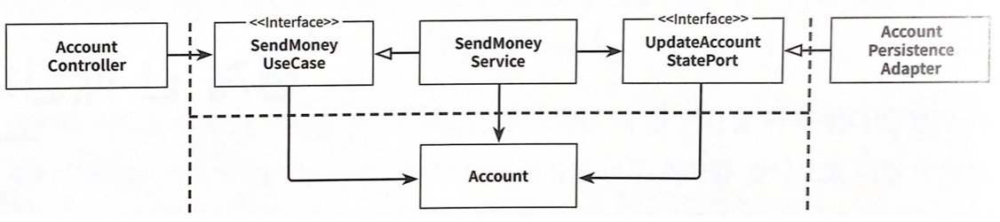
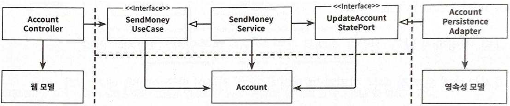
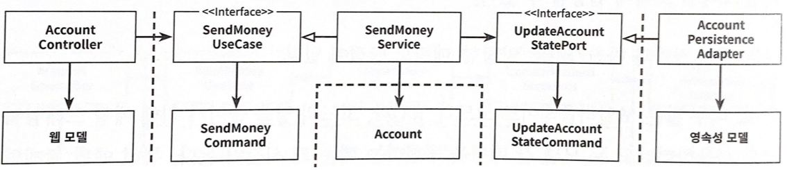
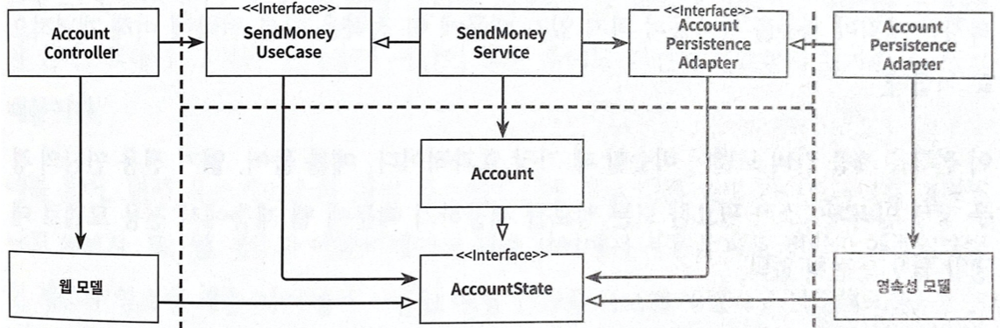

# 8장. 경계 간 매핑하기

- 아키키텍처의 여러 계층의 모델을 매핑하는 전략을 알아보자

## ‘매핑하지 않기’ 전략

포트 인터페이스가 도메인 모델을 입출력 모델로 사용하면 두 계층 간의 매핑을 할 필요가 없다.

- 위의 예제에서 웹 컨트롤러가 SendMoneyUseCase 인터페이스를 호출해서 유스케이스를 실행한다. 해당 인터페이스는 Account 객체를 인자로 가진다. 즉, 웹 계층과 애플리케이션 계층 모두 Account 클래스에 접근해야 한다는 것이다.
- 반대편의 영속성 계층과 애플리케이션 계층도 같은 관계이다.
- 모든 계층이 같은 모델을 사용하므로 계층간 매핑을 할 필요가 없다.
- 하지만 만약 웹 계층과 영속성 계층에 특별한 요구사항이 발생할 수 있다. 가령 웹계층에서 REST로 모델을 노출하면 JSON으로 직렬화하기 위한 애너테이션을 사용할 수 있고, 영속성 계층에서 ORM 프레임워크를 사용하면 특정 애너테이션이 필요할 것이다.
- Account 클래스는 도메인과 애플리케이션 계층에서 특수한 요구사항이 없지만 웹이나 영속성 계층에 관련된 이유로 변경돼야 하기 때문에 **단일 책임 원칙**을 위반한다.
- 즉, 특정한 계층만을 위한 도메인 모델이 될 수도 있다.
- 그럼 매핑하지 않기 전략이 필요할 때는 언제일까?
- 모든 계층이 정확히 같은 구조, 정확히 같은 정보를 필요로 한다면 매핑하지 않기 전략이 완벽한 선택지다.
- 만약 애플리케이션 계층이나 도메인 계층에서 웹과 영속성 문제를 다루게 되면 곧바로 다른 전략을 취해야 한다.
- 하지만 어떤 매핑 전략을 선택했더라도 나중에 언제든 바꿀 수 있다.

## ‘양방향’ 매핑 전략

각 어댑터가 전용 모델을 가지고 있어서 해당 모델을 도메인 모델로, 도메인 모델을 해당 모델로 매핑할 책임을 가지고 있다.

- 각 계층은 도메인 모델과는 완전히 다른 구조의 전용 모델을 가지고 있다.
- 웹 계층에서는 웹 모델을 인커밍 포트에서 필요한 도메인 모델로 매핑하고, 인커밍 포트에 의해 반환된 도메인 객체를 다시 웹 모델로 매핑한다.
- 영속성 계층은 아웃고잉 포트가 사용하는 도메인 모델과 영속성 모델 간의 매핑과 유사한 매핑을 담당한다.
- 두 계층 모두 양방향으로 매핑하기 때문에 ‘양방향’ 매핑이라고 부른다.
- 각 계층이 모두 전용 모델을 가지고 있어 각 계층이 전용모델을 변경 하더라도 다른 계층에는 영향이 없다. 웹이나 영속성 관심사로 오염되지 않은 깨끗한 도메인 모델로 이어지고 단일 책임 원칙을 만족한다.
- ‘양방향’ 매핑은 ‘매핑하지 않기’ 전략 다음으로 간단하다. 바깥쪽 계층/어댑터는 안쪽 계층의 모델로 매핑하고, 다시 반대방향으로 매핑한다.
- 하지만 너무 많은 보일러플레이트 코드가 생긴다. 또한 도메인 모델이 계층 경계를 넘어서 통신하는데 사용된다. 인커밍 포트와 아웃고잉 포트는 도메인 객체를 입력 파라미터와 반환값으로 사용한다. 도메인 모델은 도메인 모델의 필요에 의해서만 변경되는 것이 이상적이다.
- ‘매핑하지 않기’ 전략과 마찬가지로 ‘양방향’ 매핑 전략도 은총알이 아니다.

## ‘완전’ 매핑 전략

각 연산이 전용 모델을 필요로 하기 때문에 웹 어댑터와 애플리케이션 계층 각각이 자신의 전용 모델을 각 연산을 실행하는 데 필요한 모델로 매핑한다.

- 이 매핑 전략에서는 각 연산마다 별도의 입출력 모델을 사용한다. 계층 경계를 넘을 때마다 각 작업에 특화된 모델을 사용한다. 이런 모델을 가르켜 ‘커맨드’(command), ‘요청(request)’ 등으로 표현한다.
- 웹 계층은 입력을 애플리케이션 계층의 커맨드 객체로 매핑할 책임을 가지고 있다. 이러한 커맨드 객체는 애플리케이션 계층의 인터페이스를 해석할 여지 없이 명확하게 만들어 준다.
- 한 계층을 다른 여러개의 커맨드로 매핑하는 데는 하나의 웹 모델과 도메인 모델 간의 매핑보다 많은 코드가 필요하겠지만 구현과 유지보수하기가 쉽다는 장점이 있다.
- 이 전략은 웹 계층(혹은 인커밍 어댑터 종류 중 아무거나)과 애플리케이션 계층 사이에서 상태 변경 유스케이스의 경계를 명확하게 할 때 가장 빛을 발한다.

## ‘단방향’ 매핑 전략

동일한 ‘상태’ 인터페이스를 구현하는 도메인 모델과 어댑터 모델을 이용하면 각 계층은 다른 계층으로부터 온 객체를 단방향으로 매핑하기만 하면 된다.

- 이 전략에서는 모든 계층의 모델들이 같은 인터페이스를 구현한다. 이 인터페이스는 관련 있는 특성(attribute)에 대한 getter 메서드를 제공해서 도메인 모델의 상태를 캡슐화 한다.
- 도메인 모델 자체는 풍부한 행동을 구현할 수 있고, 애플리케이션 계층 내의 서비스에서 이러한 행동에 접근할 수 있다. 도메인 객체를 바깥 계층으로 전달하고 싶으면 매핑없이 할 수 있다. 도메인 객체가 인커밍/아웃고잉 포트가 기대하는 대로 상태 인터페이스를 구현하고 있기 때문이다.
- 바깥 계층에서는 상태 인터페이스를 이용할지, 전용 모델로 매핑해야 할지 결정할 수 있다. 행동을 변경하는 것이 상태 인터페이스에 노출 되어 있지 않기 때문에 도메인 객체의 상태를 변경하는 일은 발생하지 않는다.
- 바깥 계층에서 애플리케이션 계층으로 전달하는 객체들도 이 상태 인터페이스를 구현하고 있다. 애플리케이션 계층에서는 이 객체를 실제 도메인 모델로 매핑해서 도메인 모델의 행동에 접근할 수 있게 된다.
- 이 매핑은 팩토리(factory)라는 DDD 개념과 잘 어울린다. DDD 용어인 팩토리는 어떤 특정한 상태로부터 도메인 객체를 재구성할 책임을 가지고 있다.
- 이 전략에서 매핑 책임은 명확하다. 다른 계층으로부터 객체를 받으면 해당 계층에서 이용할 수 있도록 다른 무언가로 매핑하는 것이다.

## 언제  어떤 매핑 전략을 사용할 것인가?

- 해당 질문의 답은 ‘그때그때 다르다’이다.
- 각 매핑 전략마다 장단점이 있기 때문에 전역 규칙으로 정의를 하면 안된다.
- 소프트웨어는 지속적으로 변화하기 때문에 고정된 매핑 전략을 유지하기 보다는 간단한 전략으로 시작해 계층 간 결합을 떼어내는 데 도움이 되는 복잡한 전략으로 갈아타는 것도 괜찮은 방법이다.

## 유지보수 가능한 소프트웨어를 만드는 데 어떻게 도움이 될까?

- 각 유스케이스에 대해 좁은 포트를 사용하면 유스케이스 마다 다른 매핑 전략을 사용할 수 있고, 다른 유스케이스에 영향을 미치지 않으면서 코드를 개선할 수 있기 때문에 특정 상황, 특정 시점에 최선의 전략을 선택 할 수 있다.
