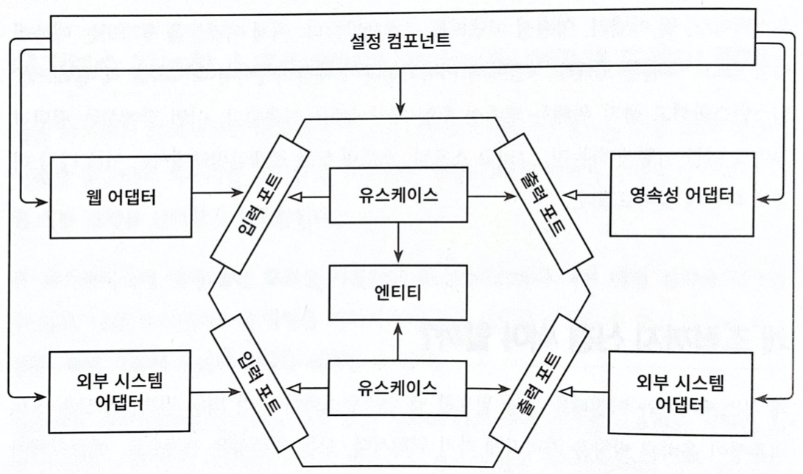

# 9장. 애플리케이션 조립하기

- 유스케이스, 웹 어댑터, 영속성 어댑터를 애플리케이션으로 조립한다.
- 자바로, 스프링, 스프링 부트로 어떻게 하는지 살펴보자.

## 왜 조립까지 신경 써야 할까?

- 왜  유스케이스와 어댑터를 그냥 필요할 때 인스턴스화하면 안되는 걸까?
- 코드 의존성이 올바른 방향으로 가르키게 하기 위해서다. 모든 의존성은 안쪽으로 애플리케이션의 도메인 코드 방향으로 향해야 한다.
- 유스케이스가 영속성 어댑터를 호출하고 스스로 인스턴스화 한다면 코드 의존성이 잘못된 방향으로 만들어진것이다. 아웃고잉 인터페이스를 생성하였고, 유스케이스는 인터페이스만 알아야 하고 런타임에 구현을 제공 받아야 한다.
- 아키텍처에 대해 중립적이고 인스턴스 생성을 위해 모든 클래스에 대한 의존성을 가지는 설정 컴포넌트가 있어야 한다
    
    
    
    중립적인 설정 컴포넌트는 인스턴스 생성을 위해 모든 클래스에 접근할 수 있다.
    
- 설정 컴포넌트는 의존성 규칙에 정의된 대로 원의 가장 바깥쪽에 위치한다.
- 설정 컴포넌트는 다음과 같은 역할을 수행해야 한다.
    - 웹 어댑터 인스턴스 생성
    - HTTP 요청이 실제로 웹 어댑터로 전달되도록 보장
    - 유스케이스 인스턴스 생성
    - 웹 어댑터에 유스케이스 인스턴스 제공
    - 영속성 어댑터 인스턴스 제공
    - 영속성 어댑터 인스턴스 생성
    - 유스케이스에 영속성 어댑터 인스턴스 제공
    - 영속성 어댑터가 실제로 데이터베이스에 접근할 수 있도록 보장
- 또한 설정 파일이나 커맨드라인 파라미터 등과 같은 설정 파라미터의 소스에도 접근할 수 있어야 한다.
- 보다시피 책임(’변경할 이유’)가 굉장히 많다. 단일 책임 원칙을 위반하지만 애플리케이션의 나머지 부분을 깔끔하게 유지하고 싶다면 구성요소들을 연결하는 바깥쪽 컴포넌트가 필요하다.

## 평범한 코드로 조립하기

- 프레임워크 도움없이 평범한 코드로 컴포넌트를 조립해보자.

```java
class Application {
	public static void main(String[] args) {

		AccountRepository accountRepository = new AccountRepository();
		ActivityRepository activityRepository = new AcitivityRepository();

		AccountPersistenceAdapter accountPersistenceAdapter = new
			AccountPersistenceAdapter(accountRepository, activityRepository);

		SendMoneyUseCase sendMoneyUseCase =
			new SendMoneyUseCase(
				accountPersistenceAdapter, // LoadAccountPort
				accountPersistenceAdapter) // UpdateAccountPort

		SendMoneyController sendMoneyController = 
			new SendMoneyController(sendMoneyUseCase);

		startProcessingWebRequests(SendMoneyController);
	}
}
```

- main 메서드 안에서 웹 컨트롤러부터 영속성 어댑터까지, 필요한 모든 클래스의 인스턴스를 생성한 후 연결한다.
- 마지막으로 웹 컨트롤러를 HTTP로 노출하는 startProcessingWebRequests()를 호출한다.
- 위의 코드는 몇가지 단점이 있다.
    - 첫번째, 위의 예는 각 계층이 하나씩만 있는 예시이다. 실제 애플리케이션은 훨씬 더 많은 코드를 작성해야 한다.
    - 두번째, 위의 설정은 외부에서 인스턴스를 생성하기 때문에 모든 클래스들이 public이어야 한다. 이렇게 되면 계층간의 분리를 할 수 없다.

## 스프링의 클래스패스 스캐닝으로 조립하기

- 스프링 프레임 워크를 이용해서 애플리케이션을 조립한 결과물을 애플리케이션 컨텍스트(application context)라고 한다. 애플리케이션 컨텍스트는 애플리케이션을 구성하는 모든 객체(bean)를 포함한다.
- 애플리케이션 컨텍스트를 조립하기 위한 몇가지 방법이 있는데 가장 많이 사용하는 클래스패스 스캐닝을 살펴보자.
- 스프링은 클래스패스 스캐닝으로 클래스패스에서 접근 가능한 모든 클래스를 확인해서 @Component 애너테이션이 붙은 클래스를 찾는다. 그리고 해당 클래스의 객체를 생성한다.

```java
@RequiredArgsConstructor
@PersistenceAdapter // @Component
class AccountPersistenceAdapter implements
		LoadAccountPort,
		UpdateAccountStatePort {

	private final SpringDataAccountRepository accountRepository;
	private final ActivityRepository activityRepository;
	private final AccountMapper accountMapper;

	@Override
	public Account loadAccount(
	// ...
	}
}
```

- 해당 클래스는 모든 필드를 인자로 받는 생성자를 가지고 있어야 한다. 여기서는 생성자를 직접 만들지 않고 Lombok 라이브러리의 @RequiredArgsConstructor를 이용해서 자동 생성했다.
- 스프링은 이 생성자를 찾아서 @Component가 붙은 인자들(클래스)을 찾고 해당 클래스들의 인스턴스를 만들어 애플리케이션 컨텍스트에 추가한다. 필요한 객체가 모두 생성되면 AccountPersistenceAdapter의 생성자를 호출하고 이 또한 애플리케이션 컨텍스트에 추가한다.

```java
@Target({ElementType.TYPE})
@Retention(RetentionPolicy.RUNTIME)
@Documented
@Component
public @interface PersistenceAdapter {

  @AliasFor(annotation = Component.class)
  String value() default "";

}
```

- 위의 예제에서는 @Component 대신 PersistenceAdapter라는 애노테이션을 직접 만들어 사용했다. @Component 애노테이션을 포함하고 있어 클래스패스 스캐닝을 할 때 인스턴스를 생성할 수 있다.
- 하지만 클래스패스 스캐닝 방식에도 단점이 있다.
    - 첫번째, 프레임워크에 특화된 애노테이션을 붙여야 한다는 점이다. 특정 프레임워크와 강한 결합이 생겨 클린아키텍처에 위배된다고 보는 주장도 있다.
    - 두번째, 스프링 전문가가 아니면 문제가 발생할 경우 원인을 찾는데 무척 어려울 수 있다.

## 스프링의 자바 컨피그로 조립하기

- 클래스패스 스캐닝이 애플리케이션 조립하기의 곤봉이라면 스프링의 자바컨피그는 수술용 메스이다.
- 모든 영속성 어댑터들의 인스턴스 생성을 담당하는 설정 클래스를 하나 만들어보자

```java
@Configuration
@EnableJpaRepositories
class PersistnectAdapterConfiguration {

	@Bean
	AccountPersistenceAdapter accountPersistenceAdapter(
			AccountRepository accountRepository,
			ActivityRepository activityRepository,
			AccountMapper accountMapper) {

		return new AccountPersistenceAdapter(
			accountRepository,
			activityRepository,
			accountMapper);
	}

	@Bean
	AccountMapper accountMapper() {
		return new AccountMapper();
	}
}
```

- @Configuration을 통해서 클래스패스 스캐닝에서 사용할 설정 클래스임을 표시해둔다. 이 또한 클래스패스 스캐닝을 사용하지만 모든 빈을 가져오지 않고 설정 클래스만 선택하기 때문에 문제가 줄어 든다.
- 빈 자체는 설정 클래스 내의 @Bean 애노테이션이 붙은 팩터리 메서드를 통해 생성된다. 영속성 어댑터는 2개의 레포지토리와 한 개의 매퍼를 생성자로 받는다. 스프링은 이 객체들을 자동으로 제공한다.
- 스프링은 @EnableJpaRepositories 애노테이션을 이용해 직접 생성해서 제공한다. 스프링 부트는 해당 애노테이션이 있을 경우 모든 스프링 데이터 레포지토리 인터페이스의 구현체를 제공한다.
- @EnableJpaRepositories는 설정클래스 뿐만 아니라 메인 애플리케이션에도 붙일 수 있다. 하지만 영속성이 실질적으로 필요 없는 테스트에서도 JPA 레포지토리를 활성화 하기 때문에 별도의 설정모듈로 옮기는 것이 좋다.
- PersistnectAdapterConfiguration를 이용하여 영속성 계층에서 필요로 하는 모든 객체를 인스턴스화 하는 매우 한정적인 범위의 영속성 모듈을 만들었다.
- 비슷한 방법으로 웹 어댑터, 혹은 애플리케이션 계층의 특정 모듈을 위한 설정 클래스를 만들 수도 있다.
- 또한 이방식에서 클래스패스 스캐닝 방식과 달리 @Component 애노테이션을 코드 여기저기에 붙이도록 강제하지 않아 애플리케이션 계층을 스프링 프레임워크에 대한 의존성 없이 깔끔하게 유지할 수 있다.
- 하지만 이 방법도 생성하는 빈들이 같은 패키지에 존재하지 않는다면 public으로 만들어야 한다.

## 유지보수 가능한 소프트웨어를 만드는 데 어떻게 도움이 될까?

- 클래스패스 스캐닝은 아주 편리한 기능이다. 패키지만 알려주면 각 클래스로 애플리케이션을 조립한다.
- 하지만 규모가 커지면 투명성이 낮아진다. 어떤빈이 애플리케이션 컨텍스트로 올라오는지 정확히 알 수 없게 된다. 또한 테스트에서 일부만 독립적으로 띄우기가 어려워 진다.
- 반면 애플리케이션 조립을 책임지는 전용 설정 컴포넌트를 만들면 애플리케이션이 이러한 책임(’변경할 이유’)로부터 자유로워 진다. 이방식을 사용하묜 다른 모듈로부터 독립되어 코드상에서 손쉽게 옮겨 다닐 수 있는 응집도가 매우 높은 모듈을 만들 수 있다.